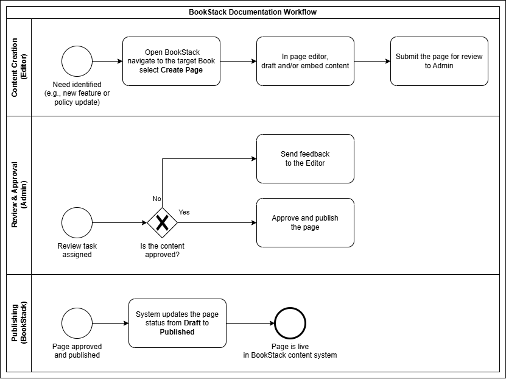

# BookStack   Business Case

September 2024

## 1. Summary

Name: BookStack

Requestor: Sergey Sergeev, Marketing Dept.

Approver: Boris Borisov, Head of Marketing Dept.

### 1.1. Business Scope

Deployment of the BookStack system in the corporate infrastructure.

BookStack is an open-source document management platform suitable for marketing documentation (lists of contractors and clients, style guides and templates etc.)

Requested and supported features:

* Hierarchical content storage allowing for clear development and update of documents.
* Thread commenting system for review and correction of the documents.
* Complex search engine with tags.
* Possibility to export and import documents.
* API for automatization of routine tasks.

### 1.2. Beneficiaries

Marketing Dept.

### 1.3. Benefits

The currently used document storage based on Windows shared folders does not fulfill the business needs. The BookStack system features would allow to:

* Increase operational effectiveness when working with documentation.
* Decrease the risk of outdated information in the documents.
* Decrease the time required to find the relevant information in the documents.

### 1.4. Implementation Time

September 2024 – November 2024

## 2. Technical Description

### 2.1. Technical Scope

The project implies the deployment of the following components of the solution:

* BookStack (PHP application)
* MariaDB (MySQL Server DB)

Additional minor customizations in the system interface may be required.

### 2.2. Implementation Schedule

2 months in total:

* Analysis: 2 weeks
* Deployment and configuration in the test environment: 4 weeks
* Deployment and configuration in the production environment: 2 weeks

### 2.3. Implementation Risks

* The base application is open-source which poses security risks.
* The base application has limited support and capacity for regular updates.

## 3. Costs and Benefits

|  | Implementation Time | Y1 | Y2 | Y3 | Total |
| --- | --- | --- | --- | --- | --- |
| **Benefits:** | | | | | Increase operational effectiveness when working with documentation.  Decrease the risk of outdated information in the documents.  Decrease the time required to find the relevant information in the documents. |
| Revenue |
| Cost saving |
| **Costs:** |  |  |  |  |  |
| Hardware | $3k |  |  |  | $3k |
| Software |  |  |  |  |  |
| Support |  | $1k | $1k | $1k | $3k |
| Costs (IT Dept.) | $5k |  |  |  | $5k |
| Costs (Marketing Dept.) | $1k |  |  |  | $1k |
| **Total:** | **$9k** | **$1k** | **$1k** | **$1k** | **$12k** |

## 4. Appendix

### 4.1. BookStack Documentation Workflow Scheme

