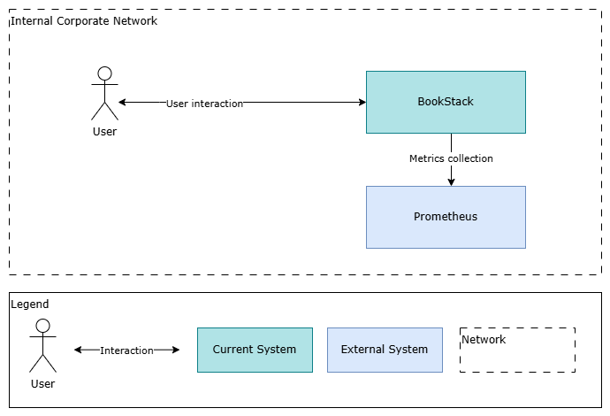

# BookStack   Project Description
September 2024 
Sample Co 
For demonstration purpose only

## 1. Document Info

The section traces the current document history from its initial composition to the latest version with indication of approval from the responsible parties.

### 1.1. Versions

| Version | Author | Date (mm/dd/yyyy) | Description of change |
| --- | --- | --- | --- |
| 1.0 | Andrey Orlov, IT Dept. | 05.09.2024 | Initial version |

### 1.2. Approval

| Version | Approved by | Date (mm/dd/yyyy) |
| --- | --- | --- |
| 1.0 | Sergey Sergeev, CIO | 07.09.2024 |
| 1.0 | Boris Borisov, Head of Marketing Dept. | 07.09.2024 |

## 2. Project Outline

### 2.1. Background

The currently used document storage based on Windows shared folders does not fulfill the business needs of the Marketing dept.

### 2.2. Objectives

Deployment of the BookStack system in the corporate infrastructure.

BookStack is an open-source document management platform suitable for marketing documentation (lists of contractors and clients, style and brand guides, templates etc.)

Required and supported features:

* Hierarchical content storage allowing for clear development and update of the documents.
* Thread commenting system for review and correction of the documents.
* Complex search engine with tags.
* Possibility to export and import documents.
* API for automation of routine tasks.

### 2.3. Business Value

The BookStack system features would allow to:

* Increase operational effectiveness when working with the documentation.
* Decrease the risk of outdated information in the documents.
* Decrease the time required to find the relevant information in the documents.

### 2.4. Budget

| Item | Estimate |
| --- | --- |
| Internal Resource cost (IT Dept.) | $5k |
| Internal Resource cost (Marketing Dept.) | $1.2k |
| Hardware (yearly amortization) | $3.2k |
| **Total:** | **$9.4k** |

## 3. Project Scope, Changes and Success Factors

### 3.1. Project Scope

The system is to be used for organized storage of the Marketing Dept. documentation

The project implies the deployment and configuration of the BookStack open-source web application in the corporate infrastructure for:

* organized storage of the content
* quick update of cross links
* advanced search across the documents
* generation of pdf files
* division of users according to the role model (viewers, editors, administrators)

### 3.2. Out of Scope

* Data migration from other resources
* Integration with other systems
* SSO authentication of user connections

### 3.3. Changes to Business Process

The BookStack system is to be used by the Marketing Dept. for document storage instead of Windows shared folders:

 *BookStack documentation workflow*

### 3.4. Success Factors

| Success Factor | Measure |
| --- | --- |
| The application provides comfortable interface and usability | A number of articles is published in BookStack during the pilot launch, no negative feedback received from the pilot group |
| User guide is provided before go-live | Users have received a comprehensive guide before commencing working in the system |

## 4. System Overview

 *BookStack System View*

## 5. Project Milestones

| Milestone | Target Completion Date |
| --- | --- |
| Pre configuration completed | 09/05/2024 |
| Analysis completed | 09/15/2024 |
| Ready for testing | 09/20/2024 |
| Ready for pilot | 10/10/2024 |
| Ready for going live | 10/19/2024 |
| Go-live | 10/20/2024 |
| Project closure | 10/31/2024 |

## 6. Risk Assessment

| Risk/Issue Description | Impact Description |
| --- | --- |
| Prolonged technical documents approval | Breaching deadlines |
| Deployment engineers may face technical difficulties | Prolonged deployment |

## 7. Project Miscellaneous

### 7.1. Assumptions

* BookStack doesn’t include any Marketing Dept. confidential information and will be deployed in general Sample Co VLAN (Production)
* BookStack will be used by Sample Co employees only
* No migration from the current documentation storage is required. The content will be recreated manually in the BookStack system and/or imported

### 7.2. Constraints

* BookStack is an open-source platform based on PHP and MySQL
* BookStack is to be run inside a Docker container

### 7.3. Dependencies

No dependencies.

## 8. Roles and Communication

### 8.1. Stakeholders

| Role | Person |
| --- | --- |
| Project Sponsor | Boris Borisov, Head of Marketing |
| Business Representative | Ruslana Ruslanova, Marketing Dept. |
| Key Customer representative, Development Lead, Deployment Lead | Pavel Pavlov, IT Dept. |
| Project Manager | Aleksandra Aleksandrova, IT Dept. |
| Deputy Development & Deployment Lead | Daniil Daniilov, IT Dept. |
| Business Analyst | Andrey Orlov, IT Dept. |
| Information Security Representative | Gleb Glebov, IT Dept. |

### 8.2. Governance

The Steering Committee:

* Ruslana Ruslanova, Marketing Dept.
* Aleksandra Aleksandrova, IT Dept.
* Pavel Pavlov, IT Dept.

### 8.3. Communications

| Communication | Format | Frequency | Distribution |
| --- | --- | --- | --- |
| Steering Committee Meeting | MS Teams meeting | On demand | Project Sponsor, Customer Representative, Project Manager |
| Status Update | MS Teams meeting | On significant milestones | Stakeholders |
| Briefing | MS Teams meeting | Weekly, On demand | Project Manager, Business Analyst, Developers, Customer Representative (optional) |
| Budget Approval | e-mail | On demand | Project Sponsor |