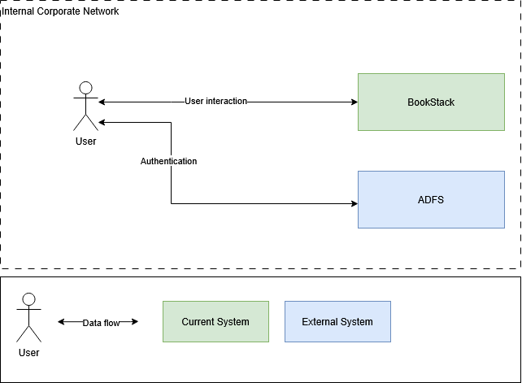

|  |
| --- |
| BookStack |
| Solution Architecture |
| November 2024 |

Contents

# Document Control

# Revision History

|  |  |  |  |
| --- | --- | --- | --- |
| Version | Author | Date (dd/mm/yyyy) | Summary of change |
| 1.0 | Ivan Ivanov | 24.11.2024 | Initial version |
| 1.1 | Ivan Ivanov | 27.12.2024 | Updated architecture overview (section 2.5) |

# Document Review and Approval

|  |  |  |
| --- | --- | --- |
| Version | Approved by | Date (dd/mm/yyyy) |
| 1.0 | Petr Petrov | 22.11.2024 |
| 1.1 | Petr Petrov | 23.12.2024 |

# Acronyms

|  |  |
| --- | --- |
| Acronym | Definition |
| ADFS | Active Directory Federation Service |
|  |  |

# References

|  |  |  |
| --- | --- | --- |
| Item no. | Document title | Version or date |
| 1 | [Source repository README](https://github.com/BookStackApp/BookStack/blob/development/readme.md) | Managed by vendor |
| 2 |  |  |

# Introduction

# Document Purpose

The document is intended as a reference for system administrators and support engineers in charge of the system deployment and maintenance.

# Solution Overview

BookStack is an opinionated documentation platform that provides a pleasant and simple out-of-the-box experience. New users to an instance should find the experience intuitive and only basic word-processing skills should be required to get involved in creating content on BookStack. The platform should provide advanced power features to those that desire it, but they should not interfere with the core simple user experience.

The BookStack source is provided under the [MIT License](https://github.com/BookStackApp/BookStack/blob/development/LICENSE).

The libraries used by, and included with, BookStack are provided under their own licenses and copyright. The licenses for many of our core dependencies can be found in the attribution list below but this is not an exhaustive list of all projects used within BookStack.

# Architecture Overview

Data flow description:

|  |  |  |  |
| --- | --- | --- | --- |
| Data flow | Source | Destination | Schedule |
| User interaction | User | BookStack | On user query |
| BookStack | User |
| Authentication | User | ADFS | On user query |
| ADFS | User |

# Responsibility Matrix

|  |  |  |
| --- | --- | --- |
| System | Vendor | Administrator |
| BookStack | BookStack | Ivan Ivanov |
| ADFS | Microsoft | Sergey Sergeev |
