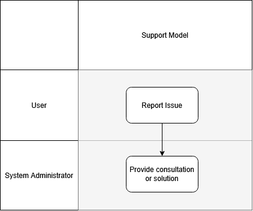

|  |
| --- |
| BookStack |
| Support Model |
| November 2024 |

Contents

# Document Control

# Revision History

|  |  |  |  |
| --- | --- | --- | --- |
| Version | Author | Date (dd/mm/yyyy) | Summary of change |
| 1.0 | Ivan Ivanov | 24.11.2024 | Initial version |
| 1.1 | Ivan Ivanov | 27.12.2024 | Updated support overview |

# Document Review and Approval

|  |  |  |
| --- | --- | --- |
| Version | Approved by | Date (dd/mm/yyyy) |
| 1.0 | Petr Petrov | 22.11.2024 |
| 1.1 | Petr Petrov | 23.12.2024 |

# Acronyms

|  |  |
| --- | --- |
| Acronym | Definition |
| ADFS | Active Directory Federation Service |
|  |  |

# References

|  |  |  |
| --- | --- | --- |
| Item no. | Document title | Version or date |
| 1 | [Source repository README](https://github.com/BookStackApp/BookStack/blob/development/readme.md) | Managed by vendor |
| 2 |  |  |

# Introduction

# Document Purpose

The document is intended as a reference on the system availability and support providers.

# Support Overview

# Support Tiers

|  |  |
| --- | --- |
| Support Tier | Definition |
| User | Report issue |
| System Administrator | Provide consultation or fix deployment-related problems |
