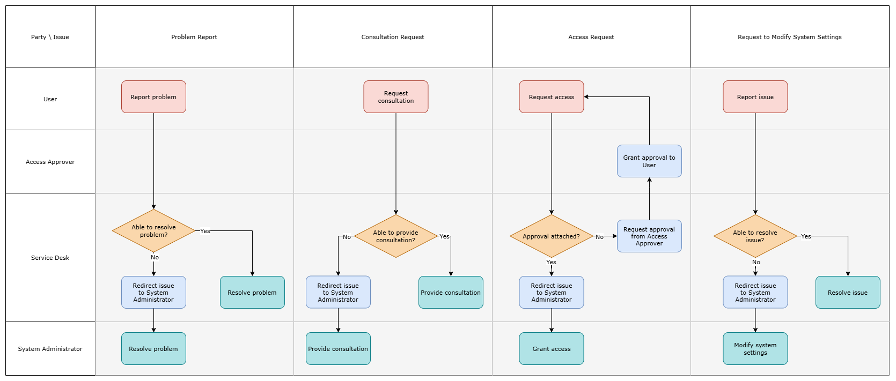

# BookStack   Support Procedures

November 2024

## 1. Document Info

The section traces the current document history from its initial composition to the latest version with indication of approval from the responsible parties. Included are the definitions of specific terms and references.

### 1.1. Versions

| Version | Author | Date (mm/dd/yyyy) | Description of Change |
| --- | --- | --- | --- |
| 1.0 | Andrey Orlov | 11.26.2024 | Initial version |
| 1.1 | Andrey Orlov | 12.27.2024 | Considerations for User Support Overview added. See [3.3. Considerations](#33-considerations) |

### 1.2. Approval

| Version | Approved by | Date (mm/dd/yyyy) |
| --- | --- | --- |
| 1.0 | Petr Petrov, System Architect | 11.27.2024 |
| 1.1 | Petr Petrov, System Architect | 12.28.2024 |

### 1.3. Terms

| Term | Definition |
| --- | --- |
| System | Information System |

### 1.4. References

| Item no. | Document title |
| --- | --- |
| 1 | [BookStack repository README](https://github.com/BookStackApp/BookStack/blob/development/readme.md) |
| 2 | [Linuxserver.io BookStack distribution](https://github.com/linuxserver/docker-bookstack) |
| 3 | [Linuxserver.io Mariadb distribution](https://github.com/linuxserver/docker-mariadb) |
| 4 | [Traefik source repository](https://github.com/traefik/traefik) |

## 2. Introduction

The section provides an overview of the current document and its subject.

### 2.1. Document Purpose

The document specifies the support procedures for an information system with indication of responsible parties and contacts. The document is intended as a reference for system administrators and support engineers.

## 3. User Support Overview

The section describes the user support procedures for the current system and specifies the parties in charge.

### 3.1. Scheme

 *BookStack user support overview*

### 3.2. Procedures

| Issue definition | Procedures |
| --- | --- |
| Problem Report: a technical problem has occurred with the system | Service Desk: if possible, resolves the problem using the knowledge base. Else, redirects the issue to System Administrator. System Administrator: resolves the problem. |
| Consultation Request: a consultation on the technical properties or functions of the system is required | Service Desk: if possible, provides consultation using the knowledge base. Else, redirects the issue to System Administrator. System Administrator: provides consultation. |
| Access Request: access to the system is required or missing | Service Desk: if access to the system is approved, redirects the issue to System Administrator. Else, requests approval from Access Approver. System Administrator: provides the access to the system. |
| Request to Modify System Settings: it is necessary to change the system settings to ensure the correct functioning | Service Desk: if possible and relevant, provides consultation on how to change the system interface settings or preferences and resolves similar minor issues. Else, redirects the issue to System Administrator. System Administrator: modifies the system settings. If necessary, consults System Owner. |

### 3.3. Considerations

Public users are allowed limited access to the system at any time and do not follow the access approval procedure.

### 3.4. Responsible Parties

| Party | Definition | Contact | Coverage |
| --- | --- | --- | --- |
| Access Approver | Boris Borisov, Management Department | BBorisov@sample.com | Working hours |
| Service Desk | Service Desk | Service@sample.com | Working hours and 9.AM-14.PM on weekend |
| System Administrator | Ivan Ivanov, Support Team | IIvanov@sample.com | Working hours |

#### End of Demonstration Fragment

To view the full document, please contact Andrew D Orlov. See [Contacts](index.md#contacts)