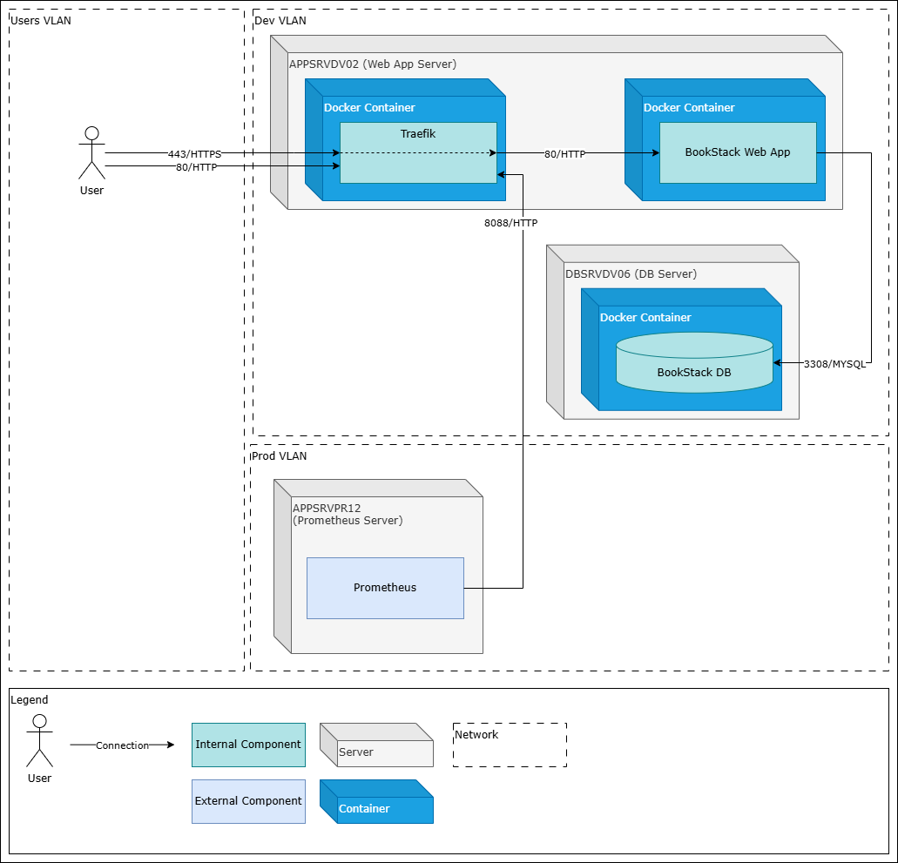
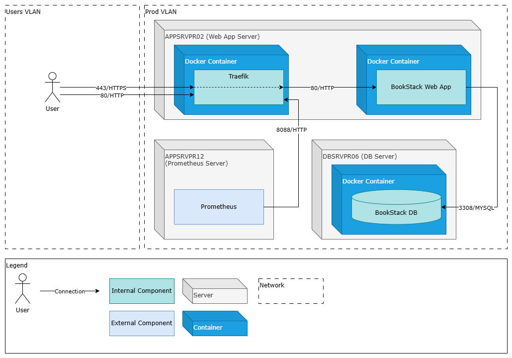
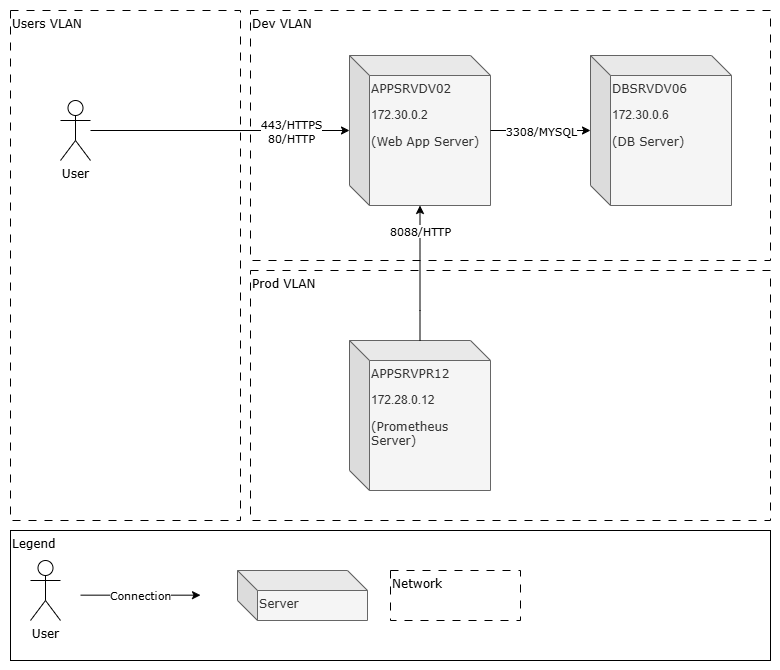
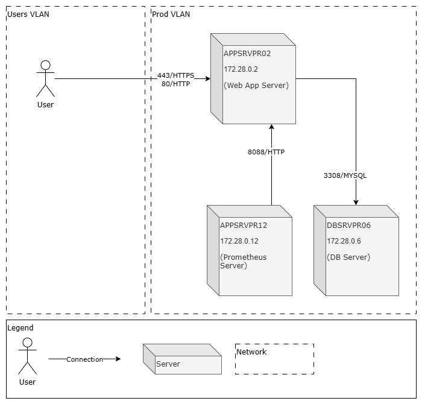

# BookStack <br> Technical Architecture

November 2024

## 1. Document Info
The section traces the current document history from its initial composition to the latest version with indication of approval from the responsible parties. Included are the definitions of specific terms and references.

### 1.1. Versions

| Version | Author | Date (mm/dd/yyyy) | Description of Change |
| --- | --- | --- | --- |
| 1.0 | Andrey Orlov | 11.25.2024 | Initial version |
| 1.1 | Andrey Orlov | 12.27.2024 | Reverse proxy (Traefik) added. Updated: [2.2. System Description](#22-system-description), [3. System Layout](#3-system-layout), [4. Logical Layout](#4-logical-layout), [5. Server Layout](#5-server-layout), [6. Network Layout](#6-network-layout), [7. Configuration](#7-configuration), [8.2 Monitoring](#82-monitoring), [9. Access and Security](#9-access-and-security) |

### 1.2. Approval

| Version | Approved by | Date (mm/dd/yyyy) |
| --- | --- | --- |
| 1.0 | Petr Petrov, System Architect | 11.26.2024 |
| 1.1 | Petr Petrov, System Architect | 12.28.2024 |

### 1.3. Terms

| Term | Definition |
| --- | --- |
| System | Information System |
| DB | Database |

### 1.4. References

| Item no. | Document title |
| --- | --- |
| 1 | [BookStack repository README](https://github.com/BookStackApp/BookStack/blob/development/readme.md) |
| 2 | [Linuxserver.io BookStack distribution](https://github.com/linuxserver/docker-bookstack) |
| 3 | [Linuxserver.io Mariadb distribution](https://github.com/linuxserver/docker-mariadb) |
| 4 | [Traefik source repository](https://github.com/traefik/traefik) |

## 2. Introduction

The section provides an overview of the current document and its subject.

### 2.1. Document Purpose

The document contains a structured technical description of an information system view with the information necessary for its deployment and maintenance.

The document is intended as a reference for system administrators and support engineers.

### 2.2. System Description

The BookStack system is a documentation platform. BookStack provides features for organization of user documents into a hierarchical structure of shelves, books, chapters, and pages. Among the main features are a complex search engine, a commenting system and a customizable document access model. Included are the default WYSIWYG and alternative Markdown text editors.

The system is operated through web user interface and API.

The current setup includes the following components:

* BookStack (LinuxServer.io Docker distribution);
* MariaDB (LinuxServer.io Docker distribution);
* Traefik (Traefik Docker distribution).

For further distribution info see: [1.4 References](#14-references), [10. Deployment](#10-deployment)

The current setup relies on the local infrastructural configurations for: VMware ESXi, Ubuntu, Docker Engine, NGFW, Prometheus, each described separately. For the system specific requirements, see [Configuration](#7-configuration)

## 3. System Layout

The section describes how the system interacts with the user and other systems inside or outside the corporate infrastructure and specifies the parties in charge of administration and maintenance of each system.

### 3.1. Scheme


<br>*BookStack System View*

### 3.2. Interaction Table

| Interaction | Source | Destination | Schedule |
| --- | --- | --- | --- |
| User interaction | User | BookStack | On user query |
| User interaction | BookStack | User | On user query |
| Metrics collection | BookStack | Prometheus | Every 15 seconds |

### 3.3. Responsible Parties

| System | Vendor | Distributor | Administrator |
| --- | --- | --- | --- |
| BookStack | Dan Brown | LinuxServer.io | Ivan Ivanov, Support Team |
| Prometheus | Cloud Native Computing Foundation (CNCF) | Cloud Native Computing Foundation (CNCF) | Daniil Danilov, Support Team |

## 4. Logical Layout

The section describes the logical components of the system and indicates their functions and relations to the user or external systems.

### 4.1. Scheme


<br>*BookStack Logical View*

### 4.2. Internal Components Table

| Component | Type | Vendor | Purpose |
| --- | --- | --- | --- |
| BookStack Web App | PHP application | Dan Brown | Acts as a wiki system and contains user documents |
| BookStack DB | MySQL Server DB | Oracle Corporation | Contains the application data |
| Reverse Proxy (Traefik) | Go application | Traefik Labs | Routes traffic from user to the application |

### 4.3. External Systems Table

| Component | Type | Vendor | Purpose |
| --- | --- | --- | --- |
| Prometheus | Go application | Cloud Native Computing Foundation (CNCF) | Metrics collection and alerting service |

## 5. Server Layout

The section describes the location of the system components on virtual or physical servers inside the corporate infrastructure and the connections between them for all existing environments.

### 5.1. Scheme

#### 5.1.1. Development Environment


<br>*BookStack Development Environment Server View*

#### 5.1.2. Production Environment


<br>*BookStack Production Environment Server View*

### 5.2. Connections Table

| Source | Destination | Port/Protocol | Authentication | Purpose |
| --- | --- | --- | --- | --- |
| User | Traefik | 443/HTTPS | No auth | User interaction (via proxy) |
| User | Traefik | 80/HTTP | No auth | User redirect to HTTPS |
| Traefik | BookStack Web App | 80/HTTP | BookStack system user login/password | User interaction (via proxy) |
| BookStack Web App | BookStack DB | 3308/MYSQL | MySQL user login/password | App data transfer |
| Prometheus | Traefik | 8088/HTTP | No auth | Metrics collection |

## 6. Network Layout

The section describes the network connections of the system with its surroundings in each existing environment.

### 6.1. Development Environment

#### 6.1.1. Scheme


<br>*BookStack Development Environment Network View*

#### 6.1.2. Connections Table

| Source | Destination | Port/Protocol | Purpose |
| --- | --- | --- | --- |
| User  (Users VLAN) | APPSRVDV02  172.30.0.2  (Web App Server) | 443/HTTPS | User interaction |
| User  (Users VLAN) | APPSRVDV02  172.30.0.2  (Web App Server) | 80/HTTP | User redirect to HTTPS |
| APPSRVDV02  172.30.0.2  (Web App Server) | DBSRVDV06  172.30.0.6  (DB Server) | 3308/MYSQL | App data transfer |
| APPSRVPR12  172.28.0.12  (Prometheus Server) | APPSRVDV02  172.30.0.2  (Web App Server) | 8088/HTTP | Metrics collection |

### 6.2. Production Environment

#### 6.2.1. Scheme


<br>*BookStack Production Environment Network View*

#### 6.2.2. Connections Table

| Source | Destination | Port/Protocol | Purpose |
| --- | --- | --- | --- |
| User  (Users VLAN) | APPSRVPR02  172.28.0.2  (Web App Server) | 443/HTTPS | User interaction |
| User  (Users VLAN) | APPSRVPR02  172.28.0.2  (Web App Server) | 80/HTTP | User redirect to HTTPS |
| APPSRVPR02  172.28.0.2  (Web App Server) | DBSRVPR06  172.28.0.6  (DB Server) | 3308/MYSQL | App data transfer |
| APPSRVPR12  172.28.0.12  (Prometheus Server) | APPSRVPR02  172.28.0.2  (Web App Server) | 8088/HTTP | Metrics collection |

## 7. Configuration

The section describes the settings required for the system operation in each existing environment. The settings generally include requirements for virtual or physical servers setup and the contents and locations of the system configuration files.

Note that specific usernames and passwords must not be included in the document.

Infrastructural configurations for network, virtual and physical environments are described separately.

### 7.1. Development Environment

#### 7.1.1. Servers

| Server | Configuration |
| --- | --- |
| APPSRVDV02 | Parameters:<br>2 vCPU, 12GB RAM, 120 GB HDD, IP 172.28.0.2, Prod VLAN, Ubuntu<br>Volumes:<br>/ : 40 GB<br>/var/log: 10 GB<br>/mnt/data: 10 GB<br>/mnt/application: 60 GB |
| DBSRVDV06 | Parameters:<br>2 vCPU, 12GB RAM, 120 GB HDD, IP 172.28.0.2, Prod VLAN, Ubuntu<br>Volumes:<br>/ : 40 GB<br>/var/log: 10 GB<br>/mnt/data: 10 GB<br>/mnt/application: 60 GB |

#### 7.1.2. Certificates

| CN | SAN | Issuer | Valid for | Path |
| --- | --- | --- | --- | --- |
| \*.bookstack.dev.internal.sample.com | bookstack.dev.internal.sample.com | Sample Internal CA | 2 years | Path: /mnt/app/traefik/certs<br>Private key file:  \_wildcard.bookstack.dev.internal.sample.com+1-key.pem<br>Certificate file:  \_wildcard.bookstack.dev.internal.sample.com+1.pem |
| bookstackdb.dev.internal.sample.com | bookstackdb.dev.internal.sample.com | Sample Internal CA | 2 years | Path: /mnt/data/mariadb/certs/<br>Private key file:  bookstackdb.dev.internal.sample.com.pem<br>Certificate file:  bookstackdb.dev.internal.sample.com-key.pem |

#### 7.1.3. Bookstack Web App

##### 7.1.3.1. .env

Path: /mnt/application/bookstack/.env

```
DB\_DATABASE=

DB\_USERNAME=

DB\_PASSWORD=

APP\_KEY=

APP\_URL=bookstack.dev.internal.sample.com
```

##### 7.1.3.2. compose.yml

Path: /mnt/application/bookstack/compose.yml

```
services:

  bookstack-dev:

    image: harbor.internal.sample.com/linuxserver/bookstack/bookstack:latest

    container\_name: bookstack-dev

    networks:

    - db\_bookstack-network

    - proxy

    environment:

      - PUID=1000

      - PGID=1000

      - TZ=Etc/UTC

      - APP\_KEY="${APP\_KEY}"

      - APP\_URL="${APP\_URL}"

      - APP\_DEBUG=false

      - DB\_HOST=mariadb

      - DB\_PORT=3308

      - DB\_USERNAME="${DB\_USERNAME}"

      - DB\_PASSWORD="${DB\_PASSWORD}"

      - DB\_DATABASE="${DB\_DATABASE}"

    volumes:

      - config:/config

      - uploads:/app/www/public/uploads

      - storage:/app/www/storage

      - themes: /app/www/themes

      - www: /app/www/

    restart: unless-stopped

networks:

  db\_bookstack-network:

    external: true

  proxy:

    external: true

volumes:

  config:

  uploads:

  storage:

  themes:

  www:
```

##### 7.1.3.3. Volumes

config: /mnt/data/bookstack/config

#### 7.1.4. BookStack DB

##### 7.1.4.1 .env

Path: /mnt/application/mariadb/.env

```
MYSQL\_ROOT\_PASSWORD=

MYSQL\_DATABASE=

MYSQL\_USER=

MYSQL\_PASSWORD=
```

##### 7.1.4.2. compose.yml

Path: /mnt/application/mariadb/compose.yml

```
services:

  mariadb:

    image: lscr.io/linuxserver/mariadb:latest

    container\_name: bookstackdb

    networks:

    - bookstack-network

    environment:

      - PUID=1000

      - PGID=1000

      - TZ=Etc/UTC

      - MYSQL\_ROOT\_PASSWORD="${MYSQL\_ROOT\_PASSWORD}"

      - MYSQL\_DATABASE="${MYSQL\_DATABASE}" #optional

      - MYSQL\_USER="${MYSQL\_USER}" #optional

      - MYSQL\_PASSWORD="${MYSQL\_PASSWORD}" #optional

      - CLI\_OPTS= --max-connections=200 --character-set-server=utf8mb4 #optional

    volumes:

      - config:/config

      - certs:/etc/mysql

    ports:

      - 3308:3308

    restart: unless-stopped

networks:

  bookstack-network:

    driver: bridge

volumes:

  config:

  certs:
```

##### 7.1.4.3. Volumes

* config: /mnt/data/mariadb/config
* certs: /mnt/data/mariadb/certs

##### 7.1.4.4. custom.cnf

Path: /mnt/data/mariadb/config/custom.cnf

```
## custom configuration file based on https://github.com/just-containers/mariadb/blob/master/rootfs/etc/mysql/my.cnf

#

# \* The MySQL database server configuration file.

#

[client]

port = 3308

socket = /run/mysqld/mysqld.sock

default-character-set = utf8mb4

# Here are entries for some specific programs

# The following values assume you have at least 32M ram

# This was formally known as [safe\_mysqld]. Both versions are currently parsed.

[mysqld\_safe]

socket = /run/mysqld/mysqld.sock

nice = 0

[mysqld]

#

# \* Basic Settings

#

user = abc

pid-file = /run/mysqld/mysqld.pid

socket = /run/mysqld/mysqld.sock

port = 3308

basedir = /usr

datadir = /var/lib/mysql

tmpdir = /tmp

lc\_messages\_dir = /usr/share/mariadb

lc\_messages = en\_US

skip-external-locking

#

# \* Fine Tuning

#

key\_buffer\_size = 128M

max\_connections = 100

connect\_timeout = 5

wait\_timeout = 600

max\_allowed\_packet = 16M

thread\_cache\_size = 128

thread\_stack = 192K

sort\_buffer\_size = 4M

bulk\_insert\_buffer\_size = 16M

tmp\_table\_size = 32M

max\_heap\_table\_size = 32M

#performance\_schema = on

character\_set\_server = utf8mb4

collation\_server = utf8mb4\_general\_ci

transaction\_isolation = READ-COMMITTED

binlog\_format = MIXED

#

# \* MyISAM

#

# This replaces the startup script and checks MyISAM tables if needed

# the first time they are touched. On error, make copy and try a repair.

myisam-recover-options = BACKUP

#open-files-limit = 2000

table\_open\_cache = 400

#table\_cache = 64

#thread\_concurrency = 10

myisam\_sort\_buffer\_size = 512M

concurrent\_insert = 2

read\_buffer\_size = 2M

read\_rnd\_buffer\_size = 1M

#

# \* Query Cache Configuration

#

# Cache only tiny result sets to fit more in the query cache.

query\_cache\_limit = 128K

query\_cache\_size = 64M

## for more write intensive setups, set to DEMAND or OFF

query\_cache\_type = DEMAND

#

# \* Logging and Replication

#

console = 1

# Both location gets rotated by the cronjob.

# May lower performance.

# As of 5.1 you can enable the log at runtime.

#general\_log = 1

#general\_log\_file = /config/log/mysql/mysql.log

#

# Error log - should be very few entries.

#

log\_warnings = 2

# Error logging goes to syslog due to /etc/mysql/conf.d/mysqld\_safe\_syslog.cnf

log\_error = /config/log/mysql/mariadb-error.log

#

# Enable the slow query log to see queries with especially long duration

slow\_query\_log = 1

slow\_query\_log\_file = /config/log/mysql/mariadb-slow.log

long\_query\_time = 5

#log\_slow\_rate\_limit = 1000

#log-queries-not-using-indexes

#log\_slow\_admin\_statements

#

# The following can be used as easy to replay backup logs or for replication.

# note: if you are setting up a replication slave, see

# https://mariadb.com/kb/en/setting-up-replication/

# about other settings you may need to change.

#server-id = 1

#report\_host = master1

#auto\_increment\_increment = 2

#auto\_increment\_offset = 1

log\_bin = /config/log/mysql/mariadb-bin

log\_bin\_index = /config/log/mysql/mariadb-bin.index

# may lower performance, but safer

#sync\_binlog = 1

#binlog\_do\_db = include\_database\_name

#binlog\_ignore\_db = include\_database\_name

expire\_logs\_days = 10

max\_binlog\_size = 100M

# slaves

# If not set in a single server environment binary logs will never be discarded - https://jira.mariadb.org/browse/MDEV-34504

slave\_connections\_needed\_for\_purge = 0

#relay\_log = /config/log/mysql/relay-bin

#relay\_log\_index = /config/log/mysql/relay-bin.index

#relay\_log\_info\_file = /config/log/mysql/relay-bin.info

#log\_slave\_updates

#read\_only

#

# If applications support it, this stricter sql\_mode prevents some

# mistakes like inserting invalid dates etc.

#sql\_mode = NO\_ENGINE\_SUBSTITUTION,TRADITIONAL

#

# \* InnoDB

#

# InnoDB is enabled by default with a 10MB datafile in /var/lib/mysql/.

# Read the manual for more InnoDB related options. There are many!

default\_storage\_engine = InnoDB

# changing log file size requires special procedure

#innodb\_log\_file\_size = 50M

innodb\_buffer\_pool\_size = 256M

innodb\_log\_buffer\_size = 8M

innodb\_file\_per\_table = 1

innodb\_open\_files = 400

innodb\_io\_capacity = 400

innodb\_flush\_method = O\_DIRECT

#

# \* Security Features

#

ssl-ca=/etc/mysql/RootCA.pem

ssl-cert=/etc/mysql/bookstackdb.dev.internal.sample.com.pem

ssl-key=/etc/mysql/bookstackdb.dev.internal.sample.com-key.pem

[mysqldump]

quick

quote-names

max\_allowed\_packet = 16M

[mysql]

#no-auto-rehash # faster start of mysql but no tab completion

[isamchk]

key\_buffer = 16M

#

# \* Galera-related settings

#

[galera]

# Mandatory settings

#wsrep\_on=ON

#wsrep\_provider=

#wsrep\_cluster\_address=

#binlog\_format=MIXED

#default\_storage\_engine=InnoDB

#innodb\_autoinc\_lock\_mode=2

#

## Allow server to accept connections on all interfaces.

#

bind-address=0.0.0.0

#

# Optional setting

#wsrep\_slave\_threads=1

#innodb\_flush\_log\_at\_trx\_commit=0
```

#### 7.1.5. Traefik

##### 7.1.5.1. compose.yml

Path: /mnt/application/traefik/

```
services:

  traefik:

    image: traefik:v3.6

    container\_name: traefik

    restart: unless-stopped

    security\_opt:

      - no-new-privileges:true

    networks:

    - proxy

    ports:

      - "80:80"

      - "443:443"

      - "8088:8088"

    volumes:

      - /mnt/application/traefik/static/traefik.yml:/traefik.yml:ro

      - /mnt/application/traefik/dynamic/routing.yml:/routing.yml:ro

      - /mnt/application/traefik/certs:/certs:ro

      - /var/log/traefik/:/var/log/traefik/

    environment:

        # ensure that the application inside the container runs with the same permissions as the host user

      - PUID=1000

        # map the container's internal processes to a specific user group on the host machine

      - PGID=1000

      - TZ=Etc/UTC

networks:

  proxy:

    name: proxy
```

##### 7.1.5.2. traefik.yml

Path: /mnt/application/traefik/static

```
## Define entry points (ports)

entryPoints:

  web:

    address: ":80"

    http:

    #redirect all requests to the https entry point

      redirections:

        entryPoint:

          to: websecure

          scheme: https

          permanent: true

  websecure:

    address: ":443"

    http:

      tls: true

  # If using a dedicated metrics entry point, define it:

  metrics:

      address: ":8088"

## Configuration providers

providers:

  file:

    filename: "/routing.yml"

    #watch: true # Reloads dynamic config without restarting Traefik

## API and Dashboard configuration

api:

  dashboard: true

  insecure: false # Warning: Only for development/internal use

## Observability

log:

  level: INFO

  filePath: "/var/log/traefik/traefik.log"

accesslog:

  filePath: "/var/log/traefik/access.log"

#enable prometheus

metrics:

  prometheus:

  # Optionally change the entry point metrics are exposed on (defaults to 'traefik'

    entrypoint: metrics

  # Add labels to metrics for routers/services (can increase cardinality)

    addrouterslabels: true

    addserviceslabels: true

    addEntryPointsLabels: true
```

##### 7.1.5.3. routing.yml

Path: /mnt/application/traefik/dynamic

```
http:

  routers:

    bookstack-dev:

      rule: "Host(`bookstack.dev.internal.sample.com`)"

      service: bookstack-dev

      entryPoints: websecure

      tls: true

    dashboard:

      rule: "Host(`dashboard.bookstack.dev.internal.sample.com`)"

      entrypoints: websecure

      service: api@internal

      tls: true

  services:

    bookstack-dev:

      loadBalancer:

        servers:

          - url: "http://bookstack-dev:80"

        passHostHeader: true

tls:

  certificates:

    - certFile: /certs/\_wildcard.bookstack.dev.internal.sample.com+1.pem

      keyFile: /certs/\_wildcard.bookstack.dev.internal.sample.com+1-key.pem
```

### 7.2. Production Environment

#### 7.2.1 Servers

| Server | Configuration |
| --- | --- |
| APPSRVPR02 | Parameters:<br>2 vCPU, 12GB RAM, 160 GB HDD, IP 172.28.0.2, Prod VLAN, Ubuntu<br>Volumes:<br>/ : 40 GB<br>/var/log: 10 GB<br>/mnt/data: 50 GB<br>/mnt/application: 60 GB |
| DBSRVPR06 | Parameters:<br>2 vCPU, 12GB RAM, 260 GB HDD, IP 172.28.0.2, Prod VLAN, Ubuntu<br>Volumes:<br>/ : 40 GB<br>/var/log: 10 GB<br>/mnt/data: 50 GB<br>/mnt/application: 60 GB<br>/mnt/backup: 100 GB |

#### 7.2.2. Certificates

| CN | SAN | Issuer | Valid for | Path |
| --- | --- | --- | --- | --- |
| \*.bookstack.internal.sample.com | bookstack.internal.sample.com | Sample Internal CA | 2 years | Path: /mnt/app/traefik/certs<br>Private key file:  \_wildcard.bookstack.internal.sample.com+1-key.pem<br>Certificate file:  \_wildcard.bookstack.internal.sample.com+1.pem |
| DBSRVPR06.internal.sample.com | DBSRVPR06.internal.sample.com | Sample Internal CA | 2 years | Path: /mnt/data/ mariadb/certs/<br>Private key file:  DBSRVPR06.internal.sample.com.pem<br>Certificate file:  DBSRVPR06.internal.sample.com-key.pem |

#### 7.2.3. Bookstack Web App

##### 7.2.3.1. .env

Path: /mnt/application/bookstack/.env

```
DB\_DATABASE=

DB\_USERNAME=

DB\_PASSWORD=

APP\_KEY=

APP\_URL=bookstack.internal.sample.com
```

##### 7.2.3.2. compose.yml

Path: /mnt/application/bookstack/compose.yml

```
services:

  bookstack:

    image: harbor.internal.sample.com/linuxserver/bookstack/bookstack:latest

    container\_name: bookstack

    networks:

    - db\_bookstack-network

    - proxy

    environment:

      - PUID=1000

      - PGID=1000

      - TZ=Etc/UTC

      - APP\_KEY="${APP\_KEY}"

      - APP\_URL="${APP\_URL}"

      - APP\_DEBUG=false

      - DB\_HOST=mariadb

      - DB\_PORT=3308

      - DB\_USERNAME="${DB\_USERNAME}"

      - DB\_PASSWORD="${DB\_PASSWORD}"

      - DB\_DATABASE="${DB\_DATABASE}"

    volumes:

      - config:/config

      - uploads:/app/www/public/uploads

      - storage:/app/www/storage

      - themes: /app/www/themes

      - www: /app/www/

    restart: unless-stopped

networks:

  db\_bookstack-network:

    external: true

  proxy:

    external: true

volumes:

  config:

  uploads:

  storage:

  themes:

  www:
```

##### 7.2.3.3. Volumes

* config: /mnt/data/bookstack/config
* uploads: /mnt/data/bookstack/uploads
* storage: /mnt/data/bookstack/storage
* themes: /mnt/data/bookstack/themes
* www: /mnt/data/bookstack/www

#### 7.2.4. BookStack DB

##### 7.2.4.1. .env

Path: /mnt/application/mariadb/.env

```
MYSQL\_ROOT\_PASSWORD=

MYSQL\_DATABASE=

MYSQL\_USER=

MYSQL\_PASSWORD=
```

##### 7.2.4.2. compose.yml

Path: /mnt/application/mariadb/compose.yml

```
services:

  mariadb:

    image: lscr.io/linuxserver/mariadb:latest

    container\_name: bookstackdb

    networks:

    - bookstack-network

    environment:

      - PUID=1000

      - PGID=1000

      - TZ=Etc/UTC

      - MYSQL\_ROOT\_PASSWORD="${MYSQL\_ROOT\_PASSWORD}"

      - MYSQL\_DATABASE="${MYSQL\_DATABASE}" #optional

      - MYSQL\_USER="${MYSQL\_USER}" #optional

      - MYSQL\_PASSWORD="${MYSQL\_PASSWORD}" #optional

      - CLI\_OPTS= --max-connections=200 --character-set-server=utf8mb4 #optional

    volumes:

      - config:/config

      - certs:/etc/mysql

    ports:

      - 3308:3308

    restart: unless-stopped

networks:

  bookstack-network:

    driver: bridge

volumes:

  config:

  certs:

  backup:
```

##### 7.2.4.3. Volumes

* config: /mnt/data/mariadb/config
* certs: /mnt/data/mariadb/certs

##### 7.2.4.4. custom.cnf

Path: /mnt/data/mariadb/config/custom.cnf

```
## custom configuration file based on https://github.com/just-containers/mariadb/blob/master/rootfs/etc/mysql/my.cnf

#

# \* The MySQL database server configuration file.

#

[client]

port = 3308

socket = /run/mysqld/mysqld.sock

default-character-set = utf8mb4

# Here are entries for some specific programs

# The following values assume you have at least 32M ram

# This was formally known as [safe\_mysqld]. Both versions are currently parsed.

[mysqld\_safe]

socket = /run/mysqld/mysqld.sock

nice = 0

[mysqld]

#

# \* Basic Settings

#

user = abc

pid-file = /run/mysqld/mysqld.pid

socket = /run/mysqld/mysqld.sock

port = 3308

basedir = /usr

datadir = /var/lib/mysql

tmpdir = /tmp

lc\_messages\_dir = /usr/share/mariadb

lc\_messages = en\_US

skip-external-locking

#

# \* Fine Tuning

#

key\_buffer\_size = 128M

max\_connections = 100

connect\_timeout = 5

wait\_timeout = 600

max\_allowed\_packet = 16M

thread\_cache\_size = 128

thread\_stack = 192K

sort\_buffer\_size = 4M

bulk\_insert\_buffer\_size = 16M

tmp\_table\_size = 32M

max\_heap\_table\_size = 32M

#performance\_schema = on

character\_set\_server = utf8mb4

collation\_server = utf8mb4\_general\_ci

transaction\_isolation = READ-COMMITTED

binlog\_format = MIXED

#

# \* MyISAM

#

# This replaces the startup script and checks MyISAM tables if needed

# the first time they are touched. On error, make copy and try a repair.

myisam-recover-options = BACKUP

#open-files-limit = 2000

table\_open\_cache = 400

#table\_cache = 64

#thread\_concurrency = 10

myisam\_sort\_buffer\_size = 512M

concurrent\_insert = 2

read\_buffer\_size = 2M

read\_rnd\_buffer\_size = 1M

#

# \* Query Cache Configuration

#

# Cache only tiny result sets to fit more in the query cache.

query\_cache\_limit = 128K

query\_cache\_size = 64M

# for more write intensive setups, set to DEMAND or OFF

query\_cache\_type = DEMAND

#

# \* Logging and Replication

#

console = 1

# Both location gets rotated by the cronjob.

# May lower performance.

# As of 5.1 you can enable the log at runtime.

#general\_log = 1

#general\_log\_file = /config/log/mysql/mysql.log

#

# Error log - should be very few entries.

#

log\_warnings = 2

# Error logging goes to syslog due to /etc/mysql/conf.d/mysqld\_safe\_syslog.cnf

log\_error = /config/log/mysql/mariadb-error.log

#

# Enable the slow query log to see queries with especially long duration

slow\_query\_log = 1

slow\_query\_log\_file = /config/log/mysql/mariadb-slow.log

long\_query\_time = 5

#log\_slow\_rate\_limit = 1000

#log-queries-not-using-indexes

#log\_slow\_admin\_statements

#

# The following can be used as easy to replay backup logs or for replication.

# note: if you are setting up a replication slave, see

# https://mariadb.com/kb/en/setting-up-replication/

# about other settings you may need to change.

#server-id = 1

#report\_host = master1

#auto\_increment\_increment = 2

#auto\_increment\_offset = 1

log\_bin = /config/log/mysql/mariadb-bin

log\_bin\_index = /config/log/mysql/mariadb-bin.index

# may lower performance, but safer

#sync\_binlog = 1

#binlog\_do\_db = include\_database\_name

#binlog\_ignore\_db = include\_database\_name

expire\_logs\_days = 10

max\_binlog\_size = 100M

# slaves

# If not set in a single server environment binary logs will never be discarded - https://jira.mariadb.org/browse/MDEV-34504

slave\_connections\_needed\_for\_purge = 0

#relay\_log = /config/log/mysql/relay-bin

#relay\_log\_index = /config/log/mysql/relay-bin.index

#relay\_log\_info\_file = /config/log/mysql/relay-bin.info

#log\_slave\_updates

#read\_only

#

# If applications support it, this stricter sql\_mode prevents some

# mistakes like inserting invalid dates etc.

#sql\_mode = NO\_ENGINE\_SUBSTITUTION,TRADITIONAL

#

# \* InnoDB

#

# InnoDB is enabled by default with a 10MB datafile in /var/lib/mysql/.

# Read the manual for more InnoDB related options. There are many!

default\_storage\_engine = InnoDB

# changing log file size requires special procedure

#innodb\_log\_file\_size = 50M

innodb\_buffer\_pool\_size = 256M

innodb\_log\_buffer\_size = 8M

innodb\_file\_per\_table = 1

innodb\_open\_files = 400

innodb\_io\_capacity = 400

innodb\_flush\_method = O\_DIRECT

#

# \* Security Features

#

ssl-ca=/etc/mysql/RootCA.pem

ssl-cert=/etc/mysql/bookstack.dev.internal.sample.com.pem

ssl-key=/etc/mysql/bookstack.dev.internal.sample.com-key.pem

[mysqldump]

quick

quote-names

max\_allowed\_packet = 16M

[mysql]

#no-auto-rehash # faster start of mysql but no tab completion

[isamchk]

key\_buffer = 16M

#

# \* Galera-related settings

#

[galera]

# Mandatory settings

#wsrep\_on=ON

#wsrep\_provider=

#wsrep\_cluster\_address=

#binlog\_format=MIXED

#default\_storage\_engine=InnoDB

#innodb\_autoinc\_lock\_mode=2

#

# Allow server to accept connections on all interfaces.

#

bind-address=0.0.0.0

#

# Optional setting

#wsrep\_slave\_threads=1

#innodb\_flush\_log\_at\_trx\_commit=0
```

#### 7.2.5. Traefik

##### 7.2.5.1. compose.yml

Path: /mnt/application/traefik/

```
services:

  traefik:

    image: traefik:v3.6

    container\_name: traefik

    restart: unless-stopped

    security\_opt:

      - no-new-privileges:true

    networks:

    - proxy

    ports:

      - "80:80"

      - "443:443"

      - "8088:8088"

    volumes:

      - /mnt/application/traefik/static/traefik.yml:/traefik.yml:ro

      - /mnt/application/traefik/dynamic/routing.yml:/routing.yml:ro

      - /mnt/application/traefik/certs:/certs:ro

      - /var/log/traefik/:/var/log/traefik/

    environment:

        # ensure that the application inside the container runs with the same permissions as the host user

      - PUID=1000

        # map the container's internal processes to a specific user group on the host machine

      - PGID=1000

      - TZ=Etc/UTC

networks:

  proxy:

    name: proxy
```

##### 7.2.5.2. traefik.yml

Path: /mnt/application/traefik/static

```
## Define entry points (ports)

entryPoints:

  web:

    address: ":80"

    http:

    #redirect all requests to the https entry point

      redirections:

        entryPoint:

          to: websecure

          scheme: https

          permanent: true

  websecure:

    address: ":443"

    http:

      tls: true

  # If using a dedicated metrics entry point, define it:

  metrics:

      address: ":8088"

## Configuration providers

providers:

  file:

    filename: "/routing.yml"

    #watch: true # Reloads dynamic config without restarting Traefik

## API and Dashboard configuration

api:

  dashboard: true

  insecure: false # Warning: Only for development/internal use

## Observability

log:

  level: INFO

  filePath: "/var/log/traefik/traefik.log"

accesslog:

  filePath: "/var/log/traefik/access.log"

#enable prometheus

metrics:

  prometheus:

  # Optionally change the entry point metrics are exposed on (defaults to 'traefik'

    entrypoint: metrics

  # Add labels to metrics for routers/services (can increase cardinality)

    addrouterslabels: true

    addserviceslabels: true

    addEntryPointsLabels: true
```

##### 7.2.5.3. routing.yml

Path: /mnt/application/traefik/dynamic

```
http:

  routers:

    bookstack:

      rule: "Host(`bookstack.internal.sample.com`)"

      service: bookstack

      entryPoints: websecure

      tls: true

    dashboard:

      rule: "Host(`dashboard.bookstack.internal.sample.com`)"

      entrypoints: websecure

      service: api@internal

      tls: true

  services:

    bookstack:

      loadBalancer:

        servers:

          - url: "http://bookstack:80"

        passHostHeader: true

tls:

  certificates:

    - certFile: /certs/\_wildcard.bookstack.internal.sample.com+1.pem

      keyFile: /certs/\_wildcard.bookstack.internal.sample.com+1-key.pem
```

## 8. Maintenance

The section contains the information required for the system maintenance such as the logs storage locations, the license management info and the details on the system monitoring, update, backup and restore procedures.

### 8.1. Logging

#### 8.1.1. Environment

Ubuntu log path: /var/log

Docker container log path: var/lib/docker/containers/

#### 8.1.2. System

##### 8.1.2.1. Bookstack Web App

Laravel general log:
/mnt/data/bookstack/config/log/bookstack/laravel.log

Nginx:

Access log:
/mnt/data/bookstack/config/log/nginx/access.log

Error log:
/mnt/data/bookstack/config/log/nginx/error.log

PHP error log:
/mnt/data/bookstack/config/log/php/error.log

##### 8.1.2.2. Bookstack DB

Query log:
/mnt/data/mariadb/config/log/mysql/mariadb-slow.log

Error log:
/mnt/data/mariadb/config/log/mysql/mariadb-error.log

##### 8.1.2.3. Traefik

Traefik log path: /var/log/traefik

#### 8.1.3. Audit

User actions are logged to:

* db: bookstack
* table: activities
* fields:
    * id
    * type
    * detail
    * user\_id
    * ip
    * loggable\_id
    * loggable\_type
    * created\_at
    * updated\_at

### 8.2. Monitoring

Monitoring is performed for all environments.

The system is monitored with the Prometheus service. Metrics address:

* Traefik: port 8088 (see [Configuration](#7-configuration))
* Docker Engine with a Prometheus metrics exporter: port 9325 (configured separately from the current system)

Traefik routing is also viewable via the dashboard for the production environment:

dashboard.bookstack.internal.sample.com

### 8.3. Backup and Restore

#### 8.3.1. Database

##### 8.3.1.1. Backup

DB name: bookstack

Cron schedule: Daily at 02.00 AM (GMT)

Means: local bash script (mysqldump)

Backup destination: /mnt/backup/bookstack/bookstack.backup.sql

Collected by: Dell EMC NetWorker

Collection schedule: Daily at 03.00 AM (GMT)

##### 8.3.1.2. Restore

The database is to be restored before running the bookstack container.

Sample script to restore the database on DB server from the mysqldump:

```
## Syntax

mysql -u {mysql\_user} -p {database\_name} < {backup\_file\_name}

### Only specify the -p if the user provided has a password
```

#### 8.3.2. Files

##### 8.3.2.1. Backup

Collected by: Dell EMC NetWorker

Collection schedule: Daily at 03.00 AM (GMT)

Files and folders to collect:

* config: /mnt/data/bookstack/config - contains important configuration information
* uploads: /mnt/data/bookstack/uploads - contains any uploaded images
* storage: /mnt/data/bookstack/storage/uploads - contains uploaded page attachments
* themes: /mnt/data/bookstack/themes - contains any configured visual/logical themes
* www: /mnt/data/bookstack/www/.env - contains important configuration information

##### 8.3.2.2. Restore

The files are to be restored to the original locations manually.

See also the [full description of the BookStack system backup and restore procedures by vendor](https://www.bookstackapp.com/docs/admin/backup-restore/)

### 8.4. Update

Updates are to be applied to the Development environment first and tested appropriately. After that, the Production environment is to be updated.

New releases are prepared by the distributor: <https://hub.docker.com/r/linuxserver/bookstack>

After a new release is available, the BookStack app container image is to be updated at: harbor.internal.sample.com/linuxserver/bookstack/

### 8.5. License

The system is based on open-source components. No license management procedures are required.

| Component | Source Link | License type | License link |
| --- | --- | --- | --- |
| BookStack | <https://github.com/linuxserver/docker-bookstack> | GPL | <https://github.com/linuxserver/docker-bookstack/blob/master/LICENSE> |
| Traefik | <https://github.com/traefik/traefik/> | MIT | <https://github.com/traefik/traefik/blob/master/LICENSE.md> |
| MariaDB | <https://github.com/linuxserver/docker-mariadb> | GPL | <https://github.com/linuxserver/docker-mariadb/blob/master/LICENSE> |

## 9. Access and Security

The section provides information on connection to the system components by services and users and specifies the relevant security procedures.

### 9.1. Environments

#### 9.1.1. Development

The table shows how the system components are distributed and run on virtual or physical servers:

| Component | Account to Run Component | Server Name | Connection Info |
| --- | --- | --- | --- |
| BookStack Web App | docker\_user | APPSRVTS02 | URL: https://bookstack.dev.internal.sample.com<br>Docker container:  bookstack-dev:80 |
| BookStack DB | docker\_user | DBSRVDV06 | DB name: bookstack<br>Login: -<br>Docker container:  mariadb:3308 |
| Reverse Proxy (Traefik) | docker\_user | APPSRVDV02 | URL: https://dashboard.bookstack.dev.internal.sample.com<br>Docker container: traefik:443 |

The table describes the deployment location of the servers:

| Server | Location | Network Segment |
| --- | --- | --- |
| APPSRVDV02 | Azure DC Europe | Development |
| DBSRVDV06 | Azure DC Europe | Development |

#### 9.1.2. Production

The table shows how the system components are distributed and run on virtual or physical servers:

| Component | Account to Run Component | Server Name | Connection Info |
| --- | --- | --- | --- |
| BookStack Web App | docker\_user | APPSRVPR02 | URL: https://bookstack.internal.sample.com<br>Docker container:  bookstack:80 |
| BookStack DB | docker\_user | DBSRVPR06 | DB name: bookstack<br>Login: -<br>Docker container: mariadb:3308 |
| Reverse Proxy (Traefik) | docker\_user | APPSRVPR02 | URL: https://dashboard.bookstack.internal.sample.com<br>Docker container:  traefik:443 |

The table describes the deployment location of the servers:

| Server | Location | Network Segment |
| --- | --- | --- |
| APPSRVPR02 | Azure DC Europe | Production |
| DBSRVPR06 | Azure DC Europe | Production |

### 9.2. User roles

#### 9.2.1. Description

* Admin: administrator of the whole application
* Editor: can edit books, chapters and pages
* Public: the role is given to public visitors
* Viewer: can view books and their content behind authentication

#### 9.2.2. Permissions

##### 9.2.2.1. System

| Permission\Role | Admin | Editor | Public | Viewer |
| --- | --- | --- | --- | --- |
| Manage all book, chapter and page permissions | Y | N | N | N |
| Manage permissions on own book, chapter and pages | Y | N | N | N |
| Manage page templates | Y | N | N | N |
| Access system API | Y | N | N | N |
| Export content | Y | Y | Y | Y |
| Import content | Y | N | N | N |
| Change page editor | Y | N | N | N |
| Receive and manage notifications | Y | N | N | N |
| Manage app settings | Y | N | N | N |
| Manage users | Y | N | N | N |
| Manage roles and role permissions | Y | N | N | N |

##### 9.2.2.2. Assets

| Asset | Permission\Role | Admin | Editor | Public | Viewer |
| --- | --- | --- | --- | --- | --- |
| Shelves | | | | | |
|  | Create | All | All | N | N |
|  | View | All | All | All | All |
|  | Edit | All | All | N | N |
|  | Delete | All | All | N | N |
| Books | | | | | |
|  | Create | All | All | N | N |
|  | View | All | All | All | All |
|  | Edit | All | All | N | N |
|  | Delete | All | All | N | N |
| Chapters | | | | | |
|  | Create | All | All | N | N |
|  | View | All | All | All | All |
|  | Edit | All | All | N | N |
|  | Delete | All | All | N | N |
| Pages | | | | | |
|  | Create | All | All | N | N |
|  | View | All | All | All | All |
|  | Edit | All | All | N | N |
|  | Delete | All | All | N | N |
| Images | | | | | |
|  | Create | Y | Y | N | N |
|  | View | Controlled by the asset they are uploaded to | | | |
|  | Edit | All | All | N | N |
|  | Delete | All | All | N | N |
| Attachments | | | | | |
|  | Create | Y | N | N | N |
|  | View | Controlled by the asset they are uploaded to | | | |
|  | Edit | All | N | N | N |
|  | Delete | All | N | N | N |
| Comments | | | | | |
|  | Create | Y | N | N | N |
|  | View | Controlled by the asset they are uploaded to | | | |
|  | Edit | All | N | N | N |
|  | Delete | All | N | N | N |

### 9.3. User access

#### 9.3.1. Authentication

For all users, login (email) / password authentication is used.

The user passwords are stored in the database. These are hashed using the standard Laravel hashing methods which use the Bcrypt hashing algorithm.

BookStack neither enforces, nor supports password complexity requirements (such as requiring special characters or digits) for user-created passwords.

#### 9.3.2. Sessions

Managed by the system:

Sessions, and therefore user logins, have a pre-set timeout before they expire. If there’s no activity during this timeout period, the session will no longer be active, and the user may need to log in again. This timeout period resets upon most system activities where the browse URL changes.

The timeout is set to 2 hours by default.

## 10. Deployment

The section provides information on the system code management and deployment procedures.

### 10.1. System components source

* BookStack local Harbor repository: harbor.internal.sample.com/linuxserver/bookstack/<br>Release branch (ready for production): master (default)
    * Current distribution source repository: <https://github.com/linuxserver/docker-bookstack>
    * Vendor source repository: <https://github.com/BookStackApp/BookStack>
* Mariadb Docker distribution repository: <https://github.com/linuxserver/docker-mariadb>
<br>Release branch (ready for production): master (default)
* Traefik source repository: <https://github.com/traefik/traefik>
<br>Release branch (ready for production): master (default)

### 10.2. Deployment process

* Set up Rootless Docker for docker\_user
* Create SSL certificates for the Development and Production environments and place them to the appropriate locations (see [Configuration](#7-configuration))
* Run the Docker compose command for all the system containers in the following order:

    1. db
    2. traefik
    3. bookstack
