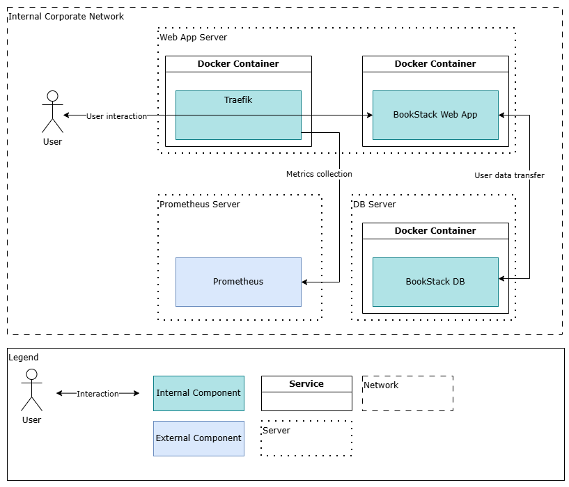

# BookStack   Technical Architecture

November 2024

## 1. Document Info
The section traces the current document history from its initial composition to the latest version with indication of approval from the responsible parties. Included are the definitions of specific terms and references.

### 1.1. Versions

| Version | Author | Date (mm/dd/yyyy) | Description of Change |
| --- | --- | --- | --- |
| 1.0 | Andrey Orlov | 11.25.2024 | Initial version |
| 1.1 | Andrey Orlov | 12.27.2024 | Reverse proxy (Traefik) added. Updated: [2.2. System Description](#22-system-description), [3. System Layout](#3-system-layout), [4. Logical Layout](#4-logical-layout) |

### 1.2. Approval

| Version | Approved by | Date (mm/dd/yyyy) |
| --- | --- | --- |
| 1.0 | Petr Petrov, System Architect | 11.26.2024 |
| 1.1 | Petr Petrov, System Architect | 12.28.2024 |

### 1.3. Terms

| Term | Definition |
| --- | --- |
| System | Information System |
| DB | Database |

### 1.4. References

| Item no. | Document title |
| --- | --- |
| 1 | [BookStack repository README](https://github.com/BookStackApp/BookStack/blob/development/readme.md) |
| 2 | [Linuxserver.io BookStack distribution](https://github.com/linuxserver/docker-bookstack) |
| 3 | [Linuxserver.io Mariadb distribution](https://github.com/linuxserver/docker-mariadb) |
| 4 | [Traefik source repository](https://github.com/traefik/traefik) |

## 2. Introduction

The section provides an overview of the current document and its subject.

### 2.1. Document Purpose

The document contains a structured technical description of an information system view with the information necessary for its deployment and maintenance.

The document is intended as a reference for system administrators and support engineers.

### 2.2. System Description

The BookStack system is a documentation platform. BookStack provides features for organization of user documents into a hierarchical structure of shelves, books, chapters, and pages. Among the main features are a complex search engine, a commenting system and a customizable document access model. Included are the default WYSIWYG and alternative Markdown text editors.

The system is operated through web user interface and API.

The current setup includes the following components:

* BookStack (LinuxServer.io Docker distribution);
* MariaDB (LinuxServer.io Docker distribution);
* Traefik (Traefik Docker distribution).

For further distribution info see: [1.4 References](#14-references)

The current setup relies on the local infrastructural configurations for: Hyper-V, Ubuntu, Docker Engine, Prometheus, each described separately.

## 3. System Layout

The section describes how the system interacts with the user and other systems inside or outside the corporate infrastructure and specifies the parties in charge of administration and maintenance of each system.

### 3.1. Scheme

 *BookStack System View*

### 3.2. Interaction Table

| Interaction | Source | Destination | Schedule |
| --- | --- | --- | --- |
| User interaction | User | BookStack | On user query |
| User interaction | BookStack | User | On user query |
| Metrics collection | BookStack | Prometheus | Every 15 seconds |

### 3.3. Responsible Parties

| System | Vendor | Distributor | Administrator |
| --- | --- | --- | --- |
| BookStack | Dan Brown | LinuxServer.io | Ivan Ivanov, Support Team |
| Prometheus | Cloud Native Computing Foundation (CNCF) | Cloud Native Computing Foundation (CNCF) | Daniil Danilov, Support Team |

## 4. Logical Layout

The section describes the logical components of the system and indicates their functions and relations to the user or external systems.

### 4.1. Scheme

 *BookStack Logical View*

### 4.2. Internal Components Table

| Component | Type | Vendor | Purpose |
| --- | --- | --- | --- |
| BookStack Web App | PHP application | Dan Brown | Acts as a wiki system and contains user documents |
| BookStack DB | MySQL Server DB | Oracle Corporation | Contains the application data |
| Reverse Proxy (Traefik) | Go application | Traefik Labs | Routes traffic from user to the application |

### 4.3. External Systems Table

| Component | Type | Vendor | Purpose |
| --- | --- | --- | --- |
| Prometheus | Go application | Cloud Native Computing Foundation (CNCF) | Metrics collection and alerting service |

#### End of Demonstration Fragment

To view the full document, please contact Andrew D Orlov. See [Contacts](cv.md#contacts)