# BookStack   User Guide

November 2024

## 1. Document Info

The section traces the current document history from its initial composition to the latest version with indication of approval from the responsible parties. Included are the definitions of specific terms and references.

### 1.1. Versions

| Version | Author | Date (mm/dd/yyyy) | Description of Change |
| --- | --- | --- | --- |
| 1.0 | Andrey Orlov | 11.26.2024 | Initial version |

### 1.2. Approval

| Version | Approved by | Date (mm/dd/yyyy) |
| --- | --- | --- |
| 1.0 | Petr Petrov, System Architect | 11.26.2024 |

### 1.3. Terms

| Term | Definition |
| --- | --- |
| System | Information System |

### 1.4. References

| Item no. | Document title |
| --- | --- |
| 1 | [BookStack vendor documentation](https://www.bookstackapp.com/docs/) |

## 2. User Guide

The section provides directions on general actions available to the BookStack system users.

### 2.1. Introduction

BookStack is a documentation platform with features for organization of user content into a hierarchical structure of objects:

* [Shelves](#23-shelves): top-level containers used to group related books together.
* [Books](#24-books): main containers for content, serving as the highest level of organization for specific topics.
* [Pages](#25-pages): objects of the lowest level that hold the actual text, images and diagrams.
* [Chapters](#26-chapters): optional containers within books used to group pages together.

Additionally, users can add [tags](#28-view-tags) to the content for flexible categorization. A tag has a key and an optional value. After a tag is applied, the content can then be queried using the tag name and value.

Among the other features are a complex [search engine](#27-find-object), a [commenting system](#257-comment-page) and a customizable document access model. Included is the default WYSIWYG [text editor](#253-edit-page) and an alternative Markdown editor.

### 2.2. Login

{:.img-sm} 
*Login*

As you open BookStack, the login screen appears. To log in:

1. Enter your corporate email.

2. Enter the password.

    Optionally:
    
    1. ??? "In case you have forgotten the password, click **Forgot Password?** The Reset Password screen will open."

             {:.img-sm} 
            *Reset Password*

            On the Reset Password screen:

            1. Enter your corporate email.

            2. Click **Send Reset Link**. A link to reset your system password will be sent to your corporate email.

    2. To remember the user, check **Remember Me**.

3. Click **Log In**. The Home screen will open.

!!! note ""
    If you are unable to log in or open the login screen, contact the Service Desk at [Service@sample.com](mailto:Service@sample.com)*

### 2.3. Shelves

#### 2.3.1. Browse Shelves

 
*Home* *To open Home, see [Login](#22-login)*

On the Home screen, click **Shelves**. The Shelves screen will open.

#### 2.3.2. Create Shelf

 
*Shelves* *To open Shelves, see [Browse Shelves](#231-browse-shelves)*

1. On the Shelves screen, click **New Shelf**. The Create New Shelf screen will open.

     {:.img-md} 
    *Create New Shelf*

    On the Create New Shelf screen:

2. Enter the name for the shelf.

    Optionally:
    
    1. Enter the description for the shelf.

    2. To add books to the shelf, drag and drop the books to the field on the left.

    3. ??? "To select a cover image, click **Cover image**."

             {:.img-md} 
            *Cover Image*

            1. Click **Select Image** and browse to the image.

    4. ??? "To add tags to the shelf, click **Shelf Tags**."

             {:.img-md} 
            *Shelf Tags*

            1. Enter the new tag name. Optionally, enter the value.

3. To save the changes, click **Save Shelf**.

#### 2.3.3. Open Shelf

 
*Shelves* *To open Shelves, see [Browse Shelves](#231-browse-shelves)*

On the Shelves screen, click on the relevant shelf. The Shelf screen will open.

#### 2.3.4. Edit Shelf

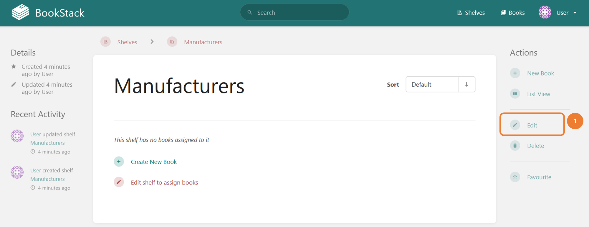 
*Shelf* *To open Shelf, see [Open Shelf](#233-open-shelf)*

1. On the Shelf screen, click **Edit Shelf**. The Edit Shelf screen will open.

     {:.img-md} 
    *Edit Shelf*

    On the Edit Shelf screen:

2. Enter the name for the shelf.

    Optionally:

    1. Enter the description for the shelf.   

    2. To add books to the shelf, drag and drop the books to the field on the left. 

    3. ??? "To select a cover image, click **Cover image**."

             {:.img-md} 
            *Cover Image*

            1. Click **Select Image** and browse to the image.

    4. ??? "To add tags to the shelf, click **Shelf Tags**."

             {:.img-md} 
            *Shelf Tags*

            1. Enter the new tag name. Optionally, enter the value.

3. To save the changes, click **Save Shelf**.

#### 2.3.5. Delete Shelf

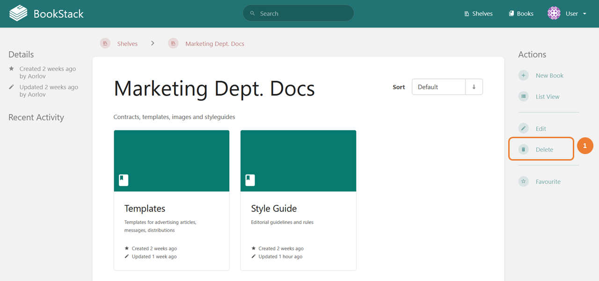 
*Shelf* *To open Shelf, see [Open Shelf](#233-open-shelf)*

1. On the Shelf screen, click **Delete Shelf**. The Delete Shelf screen will open.

     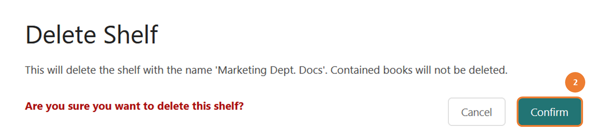{:.img-md} 
    *Delete Shelf*

2. On the Delete Shelf screen, click **Confirm**. The Shelf will be deleted.

### 2.4. Books

#### 2.4.1. Browse Books

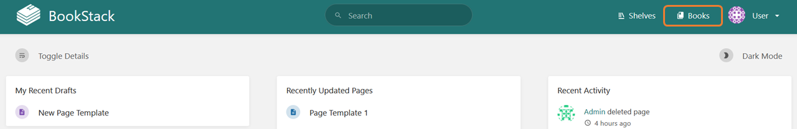 
*Home* *To open Home, see [Login](#22-login)*

On the Home screen, click **Books**. The Books screen will open.

#### 2.4.2. Create Book

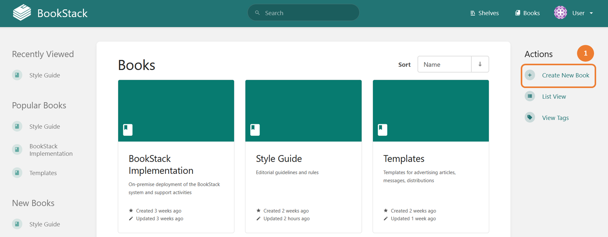 
*Books* *To open Books, see [Browse Books](#241-browse-books)*

1. On the Books screen, click **Create New Book**. The Create New Book screen will open.

     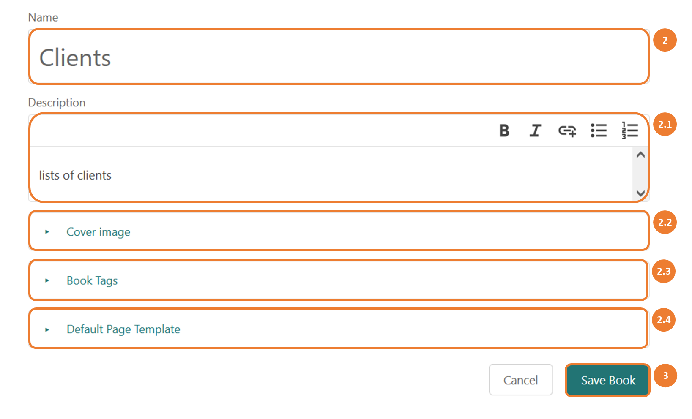{:.img-md} 
    *Create New Book*

    On the Create New Book screen:

2. Enter the name for the book.

    Optionally:

    1. Enter the description for the book.

    2. ??? "To select a cover image, click **Cover image**."

             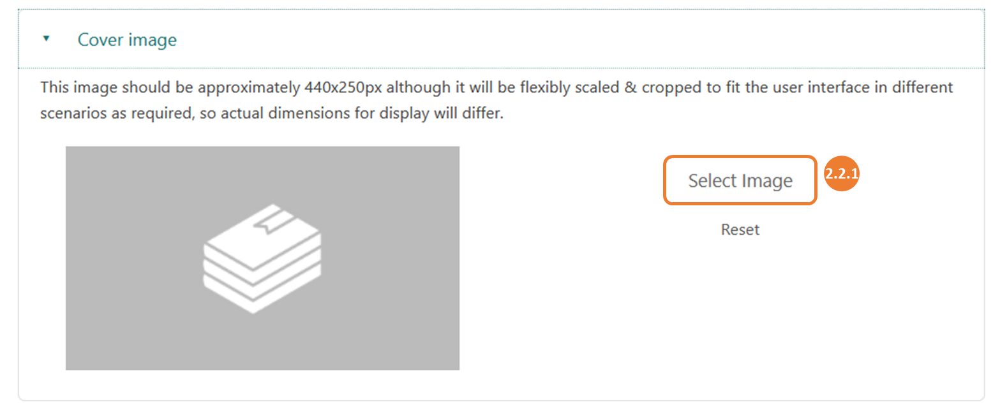{:.img-md} 
            *Cover Image*

            1. Click **Select Image** and browse to the image.

    3. ??? "To add book tags, click **Book Tags**."

             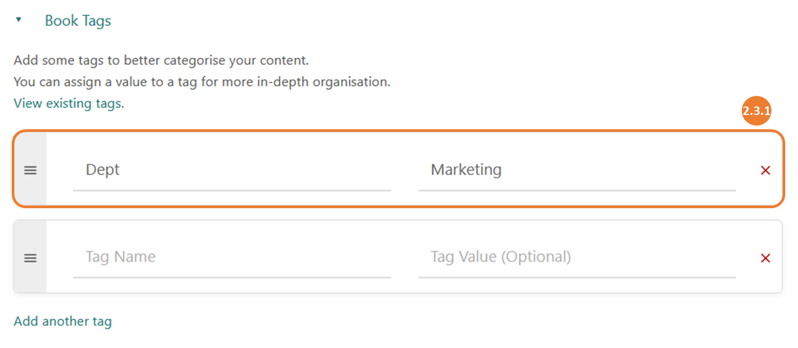{:.img-md} 
            *Book Tags*

            1. Enter the new tag name. Optionally, enter value.
        
    4. ??? "To select a default template for the new pages of the book, click **Default Page Template**."

             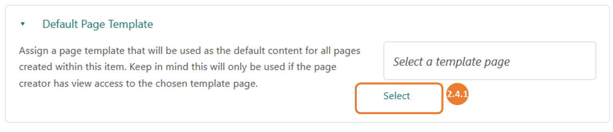{:.img-md} 
            *Default Page Template*

            1. Click **Select**.

                 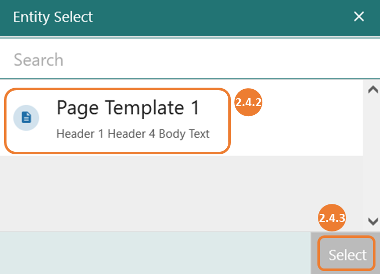{:.img-sm} 
                *Entity Select*

            2. Select the relevant page template.

            3. Click **Select**.

                *To create a page template, see [Create Page](#251-create-page)*

3. To save the changes, click **Save Book**.

#### 2.4.3. Open Book

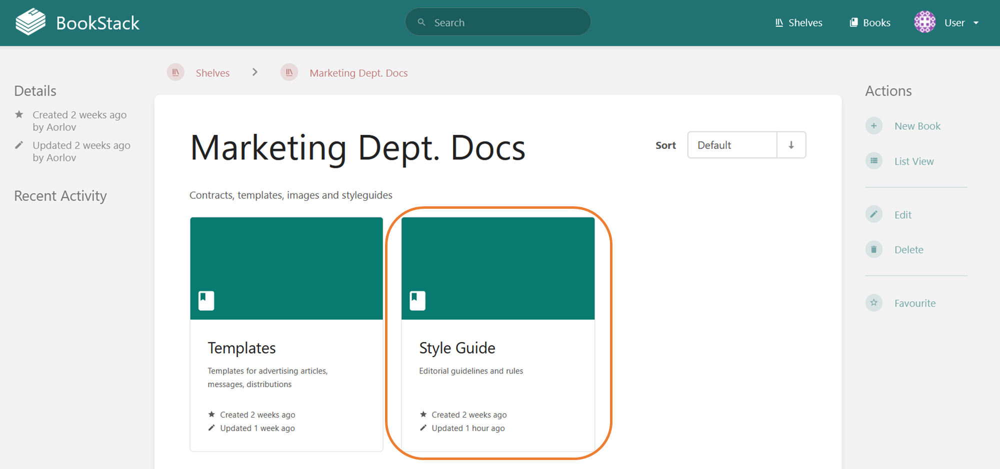 
*Books* *To open Books, see [Browse Books](#241-browse-books)*

On the Books screen, click on the relevant book. The Book screen will open.

#### 2.4.4. Edit Book

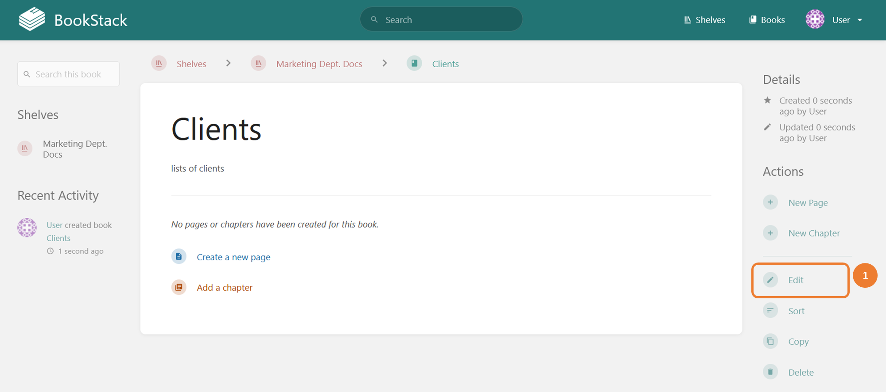 
*Book* *To open Book, see [Open Book](#243-open-book)*

1. On the Book screen, click **Edit**. The Edit Book screen will open.

     {:.img-md} 
    *Edit Book*

    On the Edit Book screen:

2. Enter the name for the book.

    Optionally:

    1. Enter the description for the book.

    2. ??? "To select a cover image, click **Cover image**."

             {:.img-md} 
            *Cover Image*

            1. Click **Select Image** and browse to the image.

    3. ??? "To add book tags, click **Book Tags**."

             {:.img-md} 
            *Book Tags*

            1. Enter the new tag name. Optionally, enter value.
        
    4. ??? "To select a default template for the new pages of the book, click **Default Page Template**."

             {:.img-md} 
            *Default Page Template*

            1. Click **Select**.

                 {:.img-sm} 
                *Entity Select*

            2. Select the relevant page template.

            3. Click **Select**.

                *To create a page template, see [Create Page](#251-create-page)*

3. To save the changes, click **Save Book**.

#### 2.4.5. Copy Book

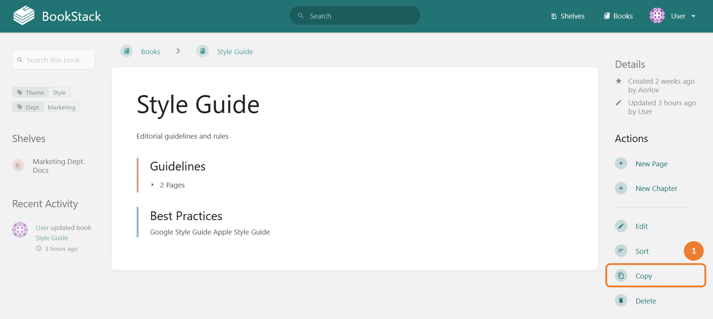 
*Book* *To open Book, see [Open Book](#243-open-book)*

1. On the Book screen, click **Copy.** The Copy Book screen will open.

     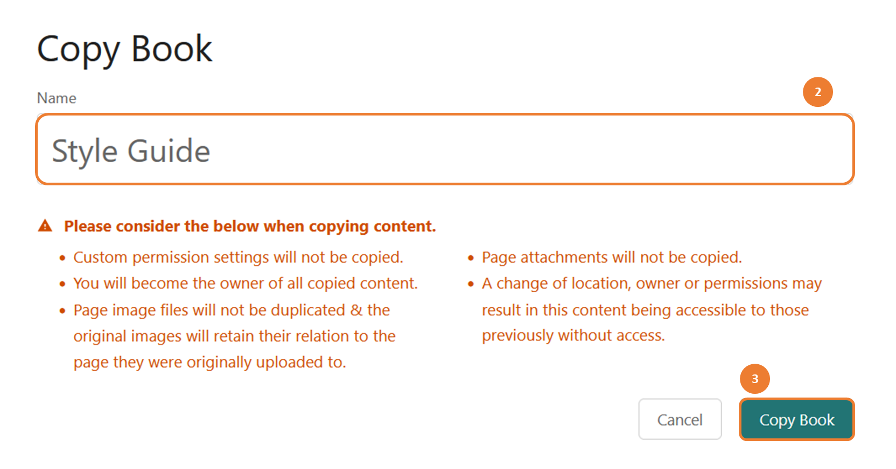{:.img-md} 
    *Copy Book*

    On the Copy Book screen:

2. Enter the name for the new book.

3. Click **Copy Book**. The book will be copied.

#### 2.4.6. Export Book

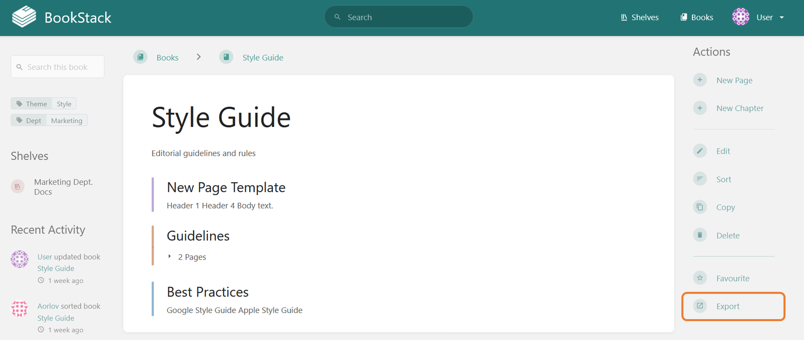 
*Book* *To open Book, see [Open Book](#243-open-book)*

On the Book screen, click **Export**. In the opened dropdown, click the relevant file extension:

* Contained Web File

* PDF File

* Plain Text File

* Markdown File

* Portable ZIP

The book will be downloaded.

!!! note ""
    BookStack supports import from ZIP files only. For the book to be suitable for import, it needs to be exported as a ZIP file.  For further information, see [Import Book](#247-import-book)

#### 2.4.7. Import Book

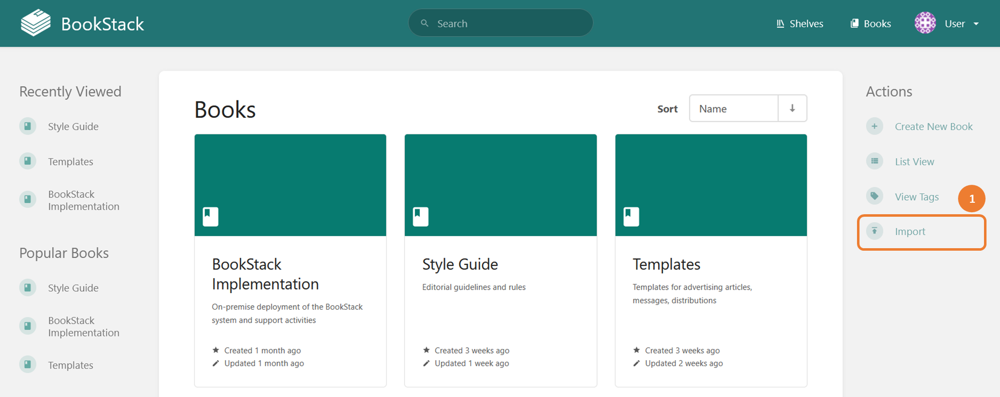 
*Books* *To open Books, see [Browse Books](#241-browse-books)*

1. On the Books screen, click **Import**. The Import screen will open.

     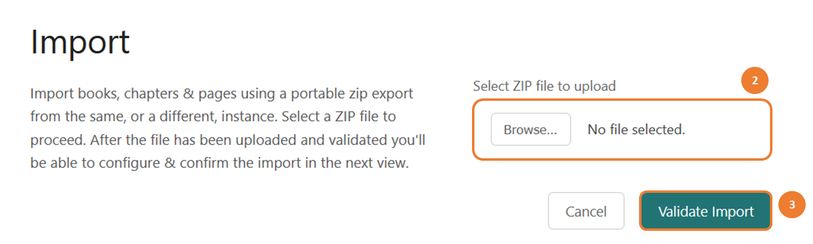{:.img-md} 
    *Import*

    On the Import screen:

2. To select a file for import, click **Browse** and select a ZIP file to upload.

3. Click **Validate Import.** The Continue Import screen will open.

     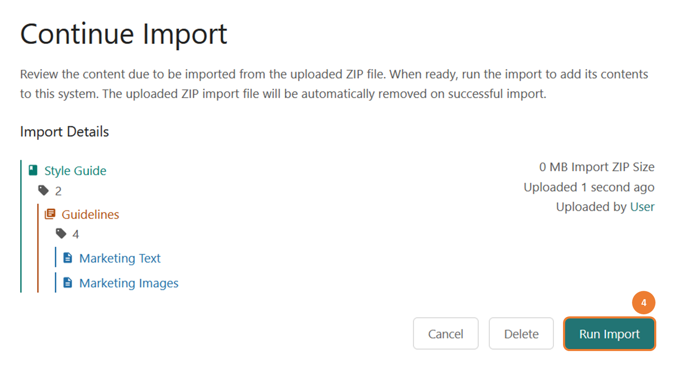{:.img-md} 
    *Continue Import*

4. On the Continue Import screen, click **Run Import**. The imported book will open.

!!! note ""
    You can import not only a book, but also a single page or a chapter. In this case, on the last step of the import, choose the destination for the imported object. Note that BookStack supports import from ZIP files only. See also: [Export Page](#256-export-page), [Export Chapter](#266-export-chapter)

#### 2.4.8. Delete Book

 
*Book* *To open Book, see [Open Book](#243-open-book)*

1. On the Book screen, click **Delete**. The Delete Book screen will open.

     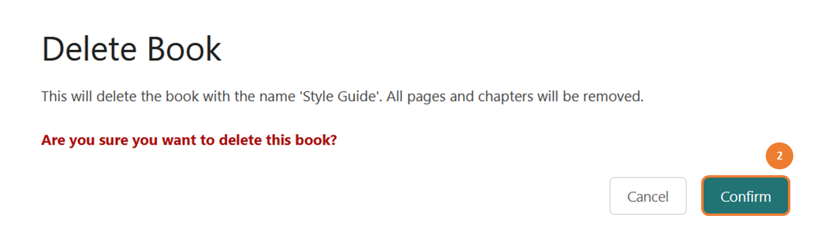{:.img-md} 
    *Delete Book*

2. On the Delete Book screen, click **Confirm**. The Book will be deleted.

### 2.5. Pages

#### 2.5.1 Create Page

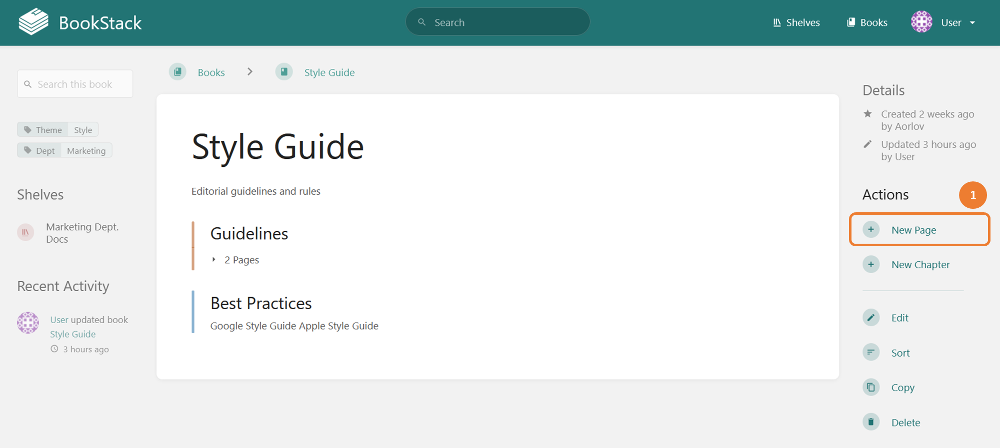 
*Book* *To open Book, see [Open Book](#243-open-book)*

1. On the Book screen, click **New Page**. The page editor screen will open.

     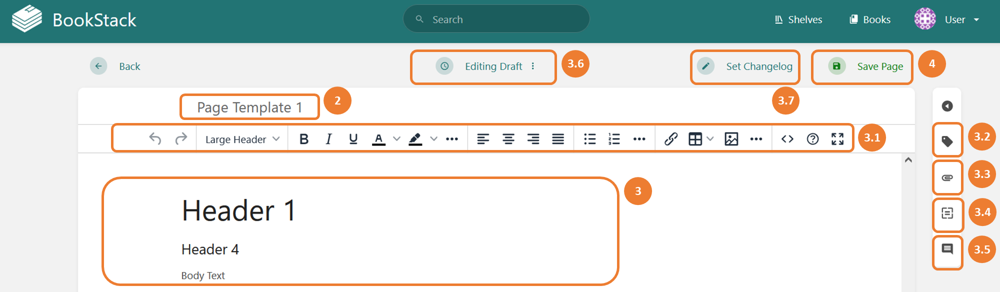 
    *Page Editor*

    The page editor allows you to write and format the actual content:

2. Enter the page title.

3. Input the page contents.

    Optionally:

    1. To format the page text, select the tools on the editor bar.

    2. ??? "To manage the page tags, click **Page Tags**."

             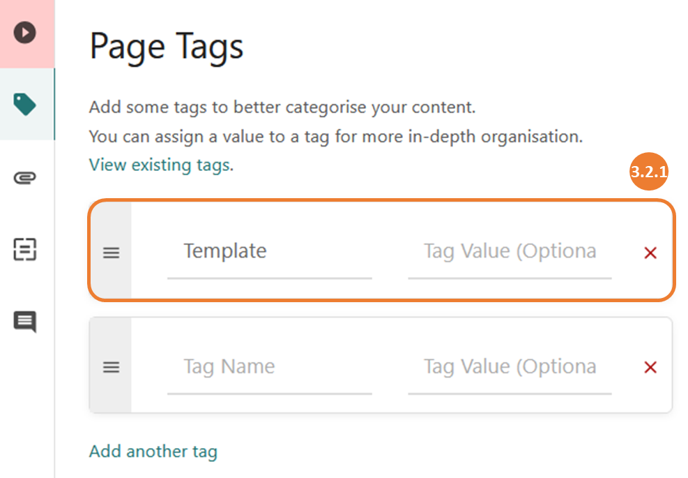{:.img-md} 
            *Page Tags*

            1. Enter the new tag name. Optionally, enter value.

    3. ??? "To manage the page attachments, click **Attachments**."

             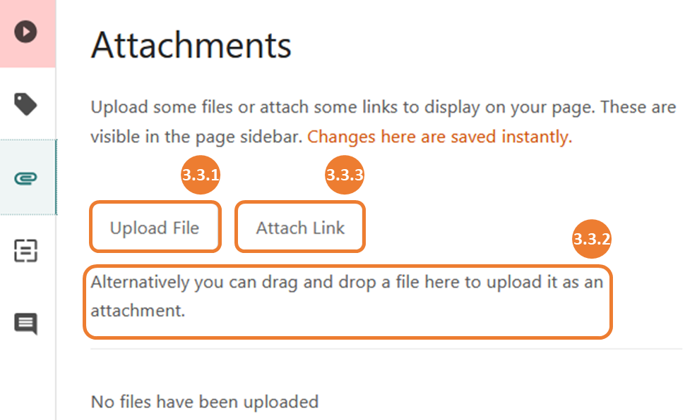{:.img-md} 
            *Attachments*

            1. To browse to the file for upload, click **Upload File**.

            2. Alternatively, to upload the file, drag and drop it to the **Attachments**.

                To attach a link:

            3. Click **Attach Link**.

                 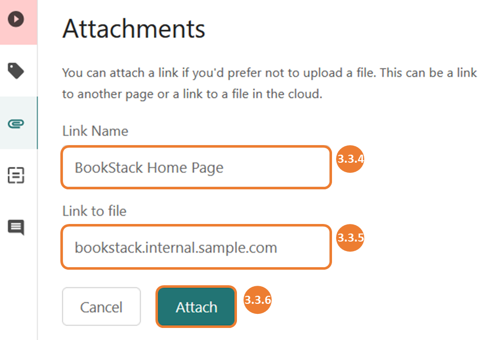{:.img-md} 
                *Attach Link*

            4. Enter the name for the link.

            5. Enter the URL.
            
            6. Click **Attach**.

    4. ??? "To manage the page templates, click **Templates**."

             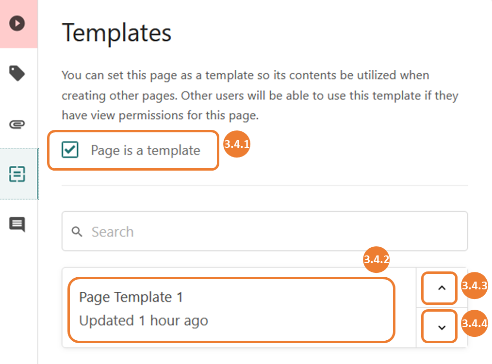{:.img-md} 
            *Templates*

            1. To use the current page as a template, check **Page is a template**.
            2. To apply a template to the text of the current page, click on the relevant template.
            3. To add the template content before the text on the current page, click **Prepend**.
            4. To add the template content after the text on the current page, click **Append**.

    5. To browse through the page comments, click **Comments**.

        *To add or modify comments, see [Comment Page](#257-comment-page)*

    6. ??? "To save or delete the current draft or to switch to another editor, click on the draft options menu."

             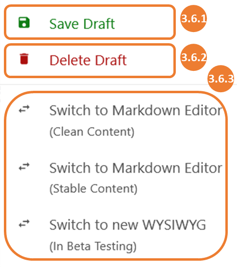{:.img-mn} 
            *Draft options*

            1. To save the current draft without making it visible to other users, click **Save Draft**.
            2. To delete the current draft with all its contents, click **Delete Draft**.
            3. To switch to another editor, select the relevant editor.
        
    7. To make a new changelog entry, click **Set Changelog** and enter a brief description of the changes you've made.

4. To save page and make it visible for other users, click **Save Page**.

    *Saving a **draft** creates a private, temporary version of the page, visible only to you, whereas saving a **page** publishes your changes, making them immediately visible to all users with appropriate permissions. Drafts automatically save every 30 seconds, while manual saving acts as a checkpoint for unfinished work.*

#### 2.5.2. Open Page

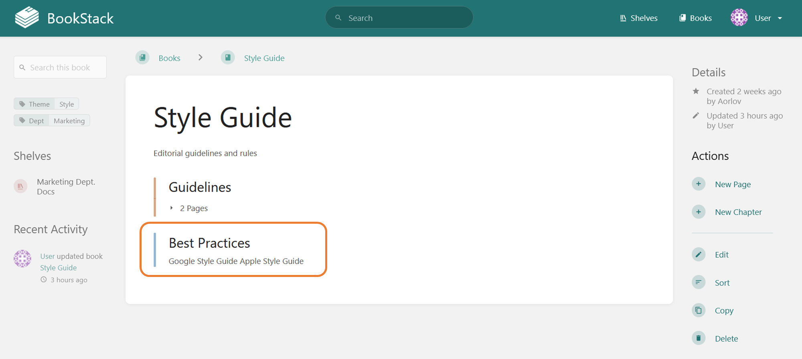 
*Book* *To open Book, see [Open Book](#243-open-book)*

On the Book page, click on the relevant page. The page will open.

#### 2.5.3. Edit Page

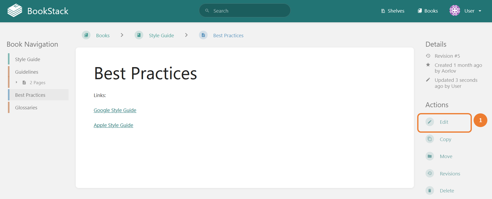 
*Page* *To open page, see [Open Page](#252-open-page)*

1. On the page screen, click **Edit**. The page editor will open.

     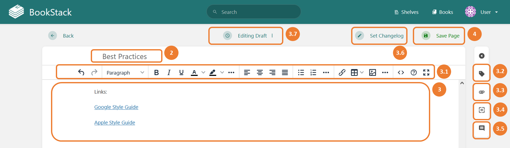 
    *Page Editor*

    The page editor allows you to write and format the actual content:

2. Enter the page title.
3. Input the page contents.

    Optionally:

    1. To format the page text, select the tools on the editor bar.
    2. ??? "To manage the page tags, click **Page Tags**."

             {:.img-md} 
            *Page Tags*

            1. Enter the new tag name. Optionally, enter value.

    3. ??? "To manage the page attachments, click **Attachments**."

             {:.img-md} 
            *Attachments*

            1. To browse to the file for upload, click **Upload File**.

            2. Alternatively, to upload the file, drag and drop it to the **Attachments**.

                To attach a link:

            3. Click **Attach Link**.

                 {:.img-md} 
                *Attach Link*

            4. Enter the name for the link.
            5. Enter the URL.
            6. Click **Attach**.

    4. ??? "To manage the page templates, click **Templates**."

             {:.img-md} 
            *Templates*

            1. To use the current page as a template, check **Page is a template**.
            2. To apply a template to the text of the current page, click on the relevant template.
            3. To add the template content before the text on the current page, click **Prepend**.
            4. To add the template content after the text on the current page, click **Append**.

    5. To browse through the page comments, click **Comments**.

        *To add or modify comments, see [Comment Page](#257-comment-page)*

    6. ??? "To save or delete the current draft or to switch to another editor, click on the draft options menu."

             {:.img-mn} 
            *Draft options*

            1. To save the current draft without making it visible to other users, click **Save Draft**.
            2. To delete the current draft with all its contents, click **Delete Draft**.
            3. To switch to another editor, select the relevant editor.

    7. To make a new changelog entry, click **Set Changelog** and enter a brief description of the changes you've made.

4. To save page and make it visible for other users, click **Save Page**.

    *Saving a **draft** creates a private, temporary version of the page, visible only to you, whereas saving a **page** publishes your changes, making them immediately visible to all users with appropriate permissions. Drafts automatically save every 30 seconds, while manual saving acts as a checkpoint for unfinished work.*

#### 2.5.4. Copy Page

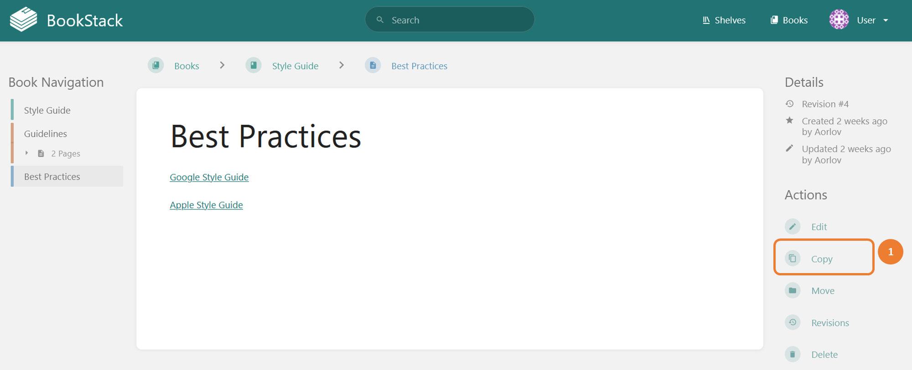 
*Page* *To open page, see [Open Page](#252-open-page)*

1. On the page screen, click **Copy**. The Copy Page screen will open.

     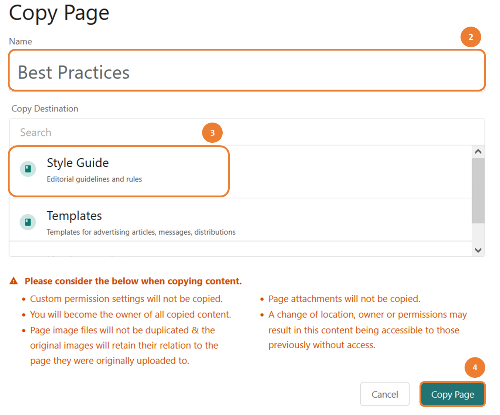{:.img-md} 
    *Copy Page*

    On the Copy Page screen:

2. Enter the name for the new page.
3. To select the copy destination, click on the relevant book.
4. Click **Copy Page**. The page will be copied.

#### 2.5.5. Move Page

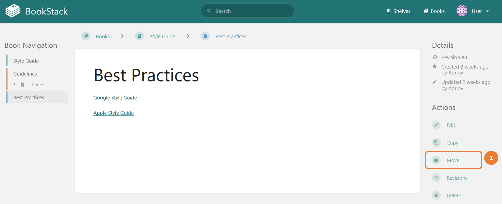 
*Page* *To open Page, see [Open Page](#252-open-page)*

1. On the page screen, click **Move**. The Move Page screen will open.

     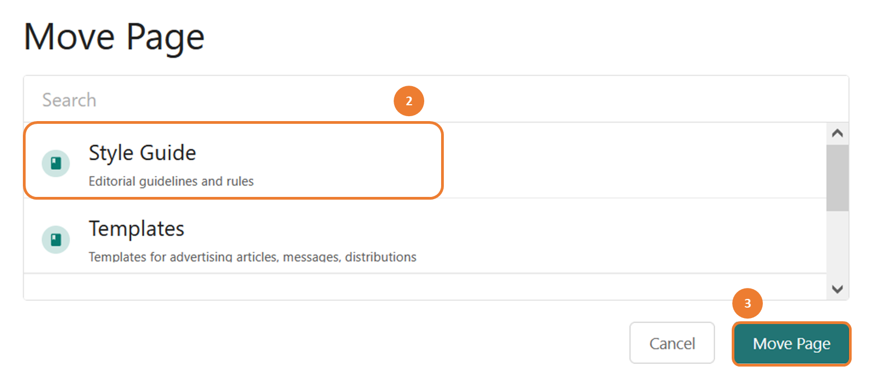{:.img-md} 
    *Move Page*

    On the Move Page screen:

2. To select the destination for the page, click on the relevant book.

3. Click **Move Page**. The page will be moved.

#### 2.5.6. Export Page

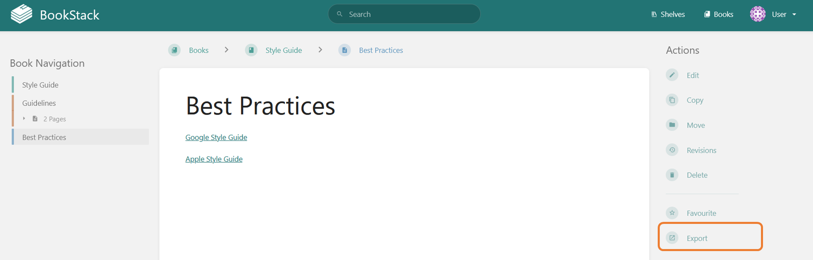 
*Page* *To open Page, see [Open Page](#252-open-page)*

On the page screen, click **Export**. In the opened dropdown, click the relevant file extension:

* Contained Web File

* PDF File

* Plain Text File

* Markdown File

* Portable ZIP

The page will be downloaded.

!!! note ""
    BookStack supports import from ZIP files only. For the book to be suitable for import, it needs to be exported as a ZIP file.  For further information, see [Import Book](#247-import-book)

#### 2.5.7. Comment Page

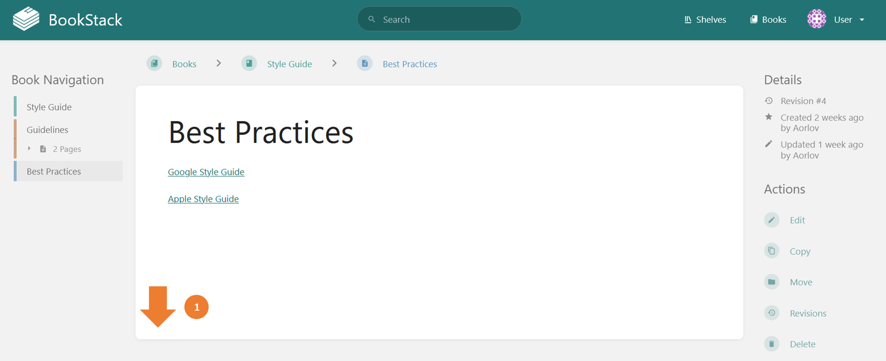 
*Page* *To open Page, see [Open Page](#252-open-page)*

1. On the page screen, scroll down to the comments section.

     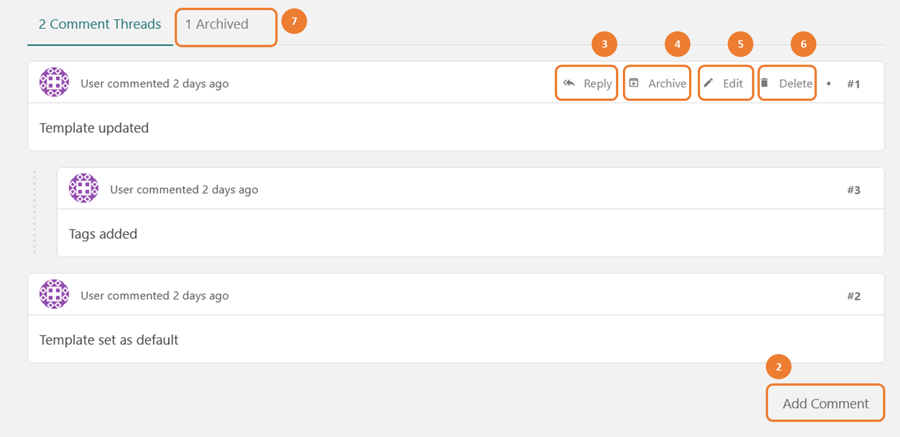 
    *Comments*

2. To add a new comment thread, click **Add Comment**.

3. To reply to a previous comment in a thread, click **Reply**.

4. To archive a comment thread, click **Archive**.

5. To edit a comment, click **Edit**.

6. To delete a comment thread, click **Delete**.

7. To browse archived comments, click **Archived**.

#### 2.5.8. Delete Page

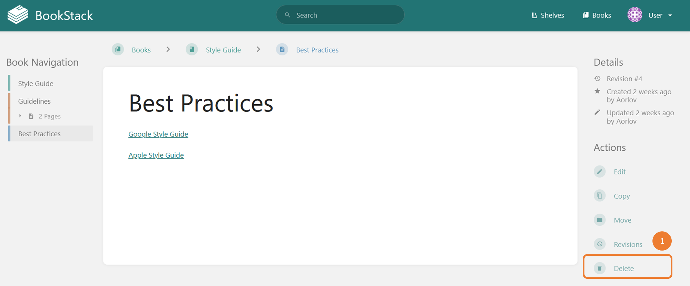 
*Page* *To open Page, see [Open Page](#252-open-page)*

1. On the page screen, click **Delete**. The Delete Page screen will open.

     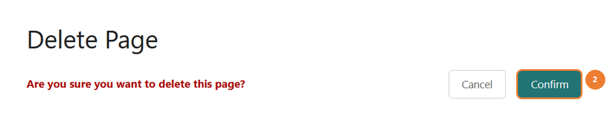{:.img-md} 
    *Delete Page*

2. On the Delete Page screen, click **Confirm**. The page will be deleted.

### 2.6. Chapters

#### 2.6.1. Create Chapter

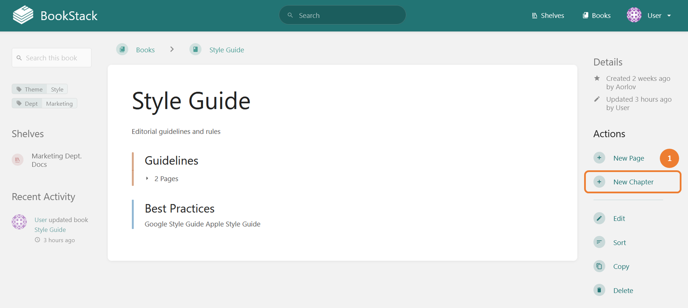 
*Book* *To open Book, see [Open Book](#243-open-book)*

1. On the Book screen, click **New Chapter**. The Create New Chapter screen will open.

     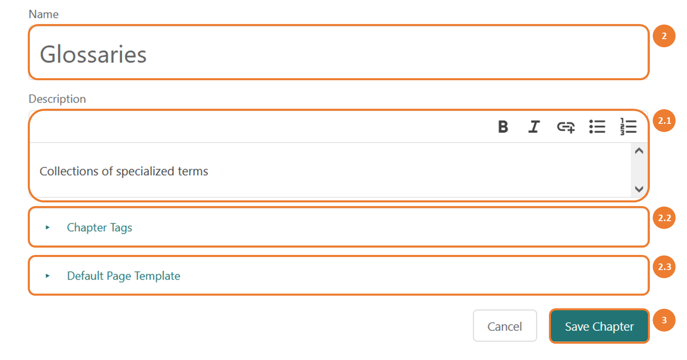{:.img-md} 
    *Create New Chapter*

    On the Create New Chapter screen:

2. Enter the name for the chapter.

    Optionally:

    1. Enter the description for the Chapter.

    2. ??? "To add chapter tags, click **Chapter Tags**."

             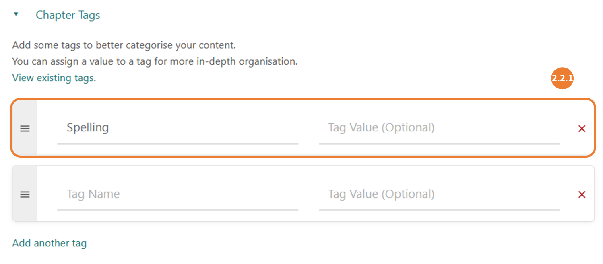{:.img-md} 
            *Chapter Tags*

            1. Enter the new tag name. Optionally, enter value.

    1. ??? "To select a default template for new pages of the Chapter, click **Default Page Template**."

             {:.img-md} 
            *Default Page Template*

            1. Click **Select**.

                 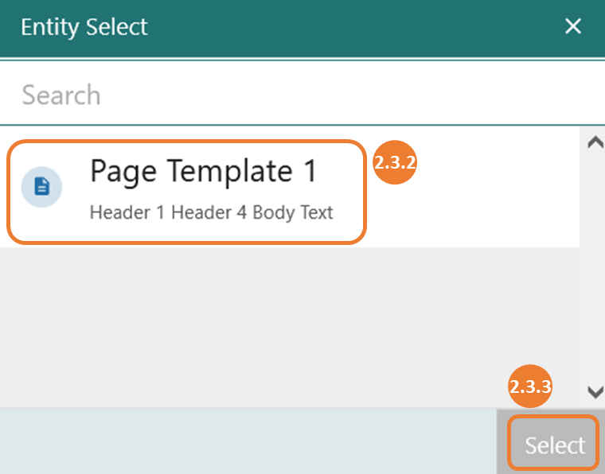{:.img-sm} 
                *Entity Select*

            2. Select the relevant page template.
            
            3. Click **Select**.

3. To save the changes, click **Save Chapter**.

#### 2.6.2. Open Chapter

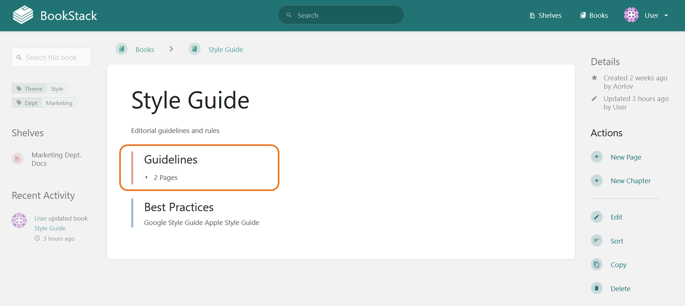 
*Book* *To open Book, see [Open Book](#243-open-book)*

On the Book screen, click on the chapter. The Chapter screen will open.

#### 2.6.3. Edit Chapter

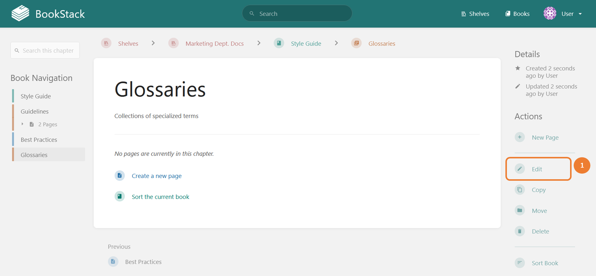 
*Chapter* *To open Chapter, see [Open Chapter](#262-open-chapter)*

1. On the Chapter screen, click **Edit**. The Edit Chapter screen will open.

     {:.img-md} 
    *Edit Chapter*

    On the Edit Chapter screen:

2. Enter the name for the chapter.

    Optionally:

    1. Enter the description for the Chapter.

    2. ??? "To add chapter tags, click **Chapter Tags**."

             {:.img-md} 
            *Chapter Tags*

            1. Enter the new tag name. Optionally, enter value.

    3. ??? "To select a default template for new pages of the Chapter, click **Default Page Template**."

             {:.img-md} 
            *Default Page Template*

            1. Click **Select**.

                 {:.img-sm} 
                *Entity Select*

            2. Select the relevant page template.
            
            3. Click **Select**.

3. To save the changes, click **Save Chapter**.

#### 2.6.4. Copy Chapter

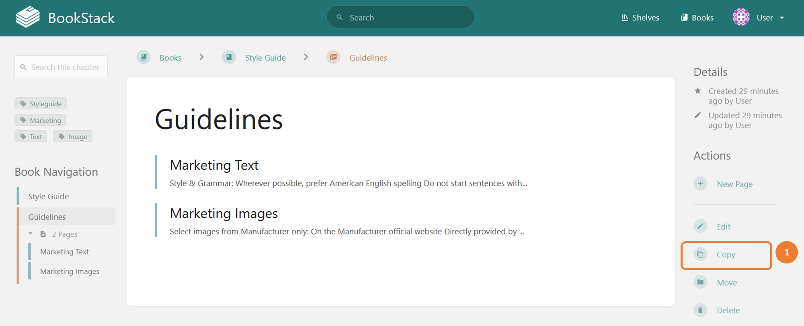 
*Chapter* *To open Chapter, see [Open Chapter](#262-open-chapter)*

1. On the Chapter screen, click **Copy**. The Copy Chapter screen will open.

     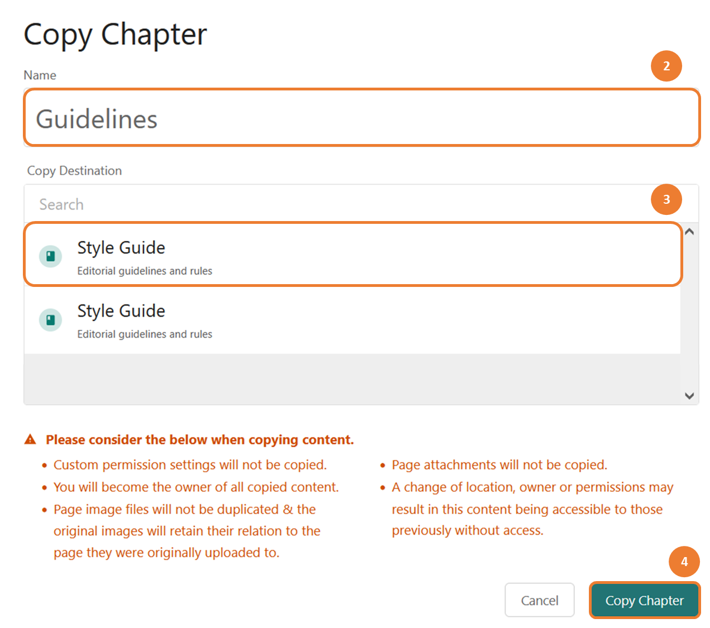{:.img-md} 
    *Copy Chapter*

    On the Copy Chapter screen:

2. Enter the name for the new chapter.

3. To select the copy destination, click on the relevant book.

4. Click **Copy Chapter**. The chapter will be copied.

#### 2.6.5. Move Chapter

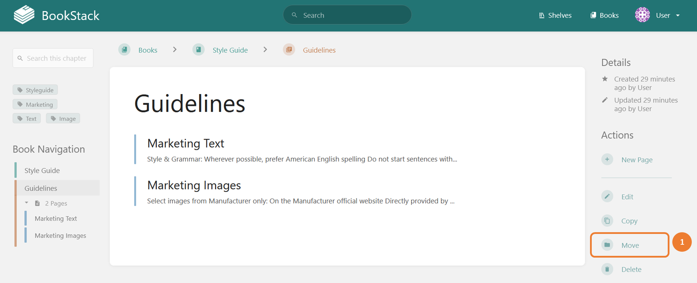 
*Chapter* *To open Chapter, see [Open Chapter](#262-open-chapter)*

1. On the Chapter screen, click **Move**. The Move Chapter screen will open.

     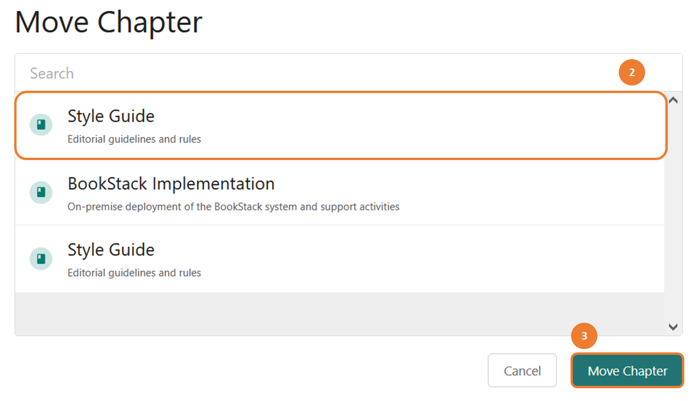{:.img-md} 
    *Move Chapter*

    On the Move Chapter screen:

2. To select the destination, click on the relevant book.
3. Click **Move Chapter**. The chapter will be moved.

#### 2.6.6. Export Chapter

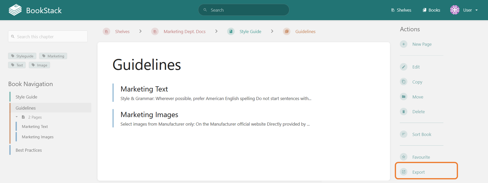 
*Chapter* *To open Chapter, see [Open Chapter](#262-open-chapter)*

On the Chapter screen, click **Export.** In the opened dropdown, click the relevant file extension:

* Contained Web File
* PDF File
* Plain Text File
* Markdown File
* Portable ZIP

The chapter will be downloaded.

!!! note ""
    BookStack supports import from ZIP files only. For the book to be suitable for import, it needs to be exported as a ZIP file.  For further information, see [Import Book](#247-import-book)

#### 2.6.7. Delete Chapter

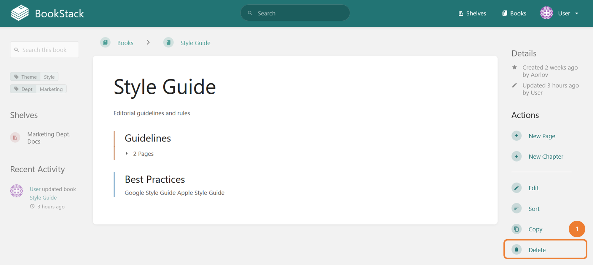 
*Chapter* *To open Chapter, see [Open Chapter](#262-open-chapter)*

1. On the Chapter screen, click **Delete**. The Delete Chapter screen will open.

     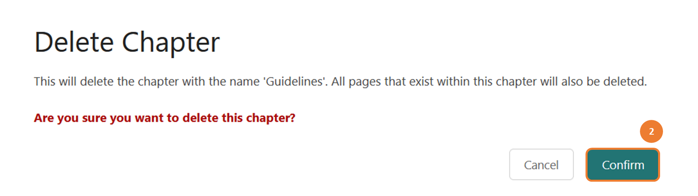{:.img-md} 
    *Delete Chapter*

2. On the Delete Chapter screen, click **Confirm**. The chapter will be deleted.

### 2.7. Find Object

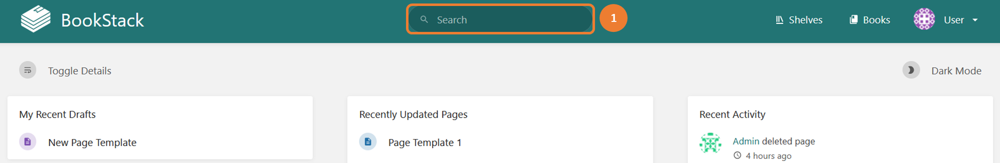 
*Home* *To open Home, see [Login](#22-login)*

1. On top of any screen, start typing the object name into the search textbox. The search results dropdown will open.

     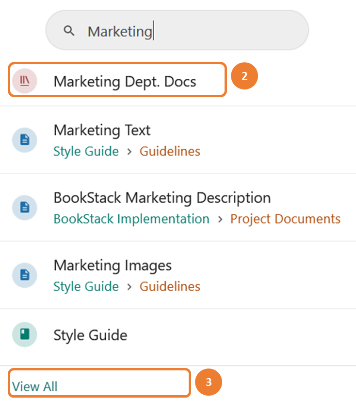{:.img-sm} 
    *Search results*

    In the search results dropdown:

2. To open the relevant object, click on it.

3. To continue searching, click **View All**. The Advanced Search window with all available query options will open.

### 2.8. View Tags

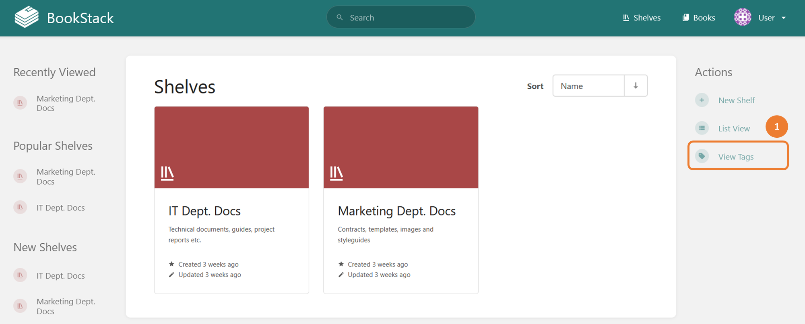 
*Shelves* *To open Shelves, see [Browse Shelves](#231-browse-shelves)*

 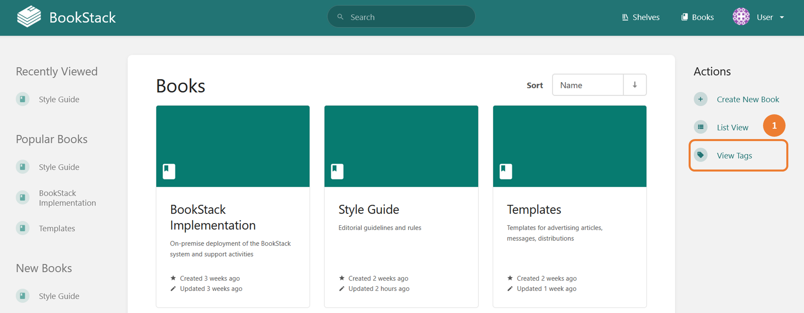 
*Books* *To open Books, see [Browse Books](#241-browse-books)*

1. On the Shelves or Books screen, click **View Tags**. The Tags screen will open.

     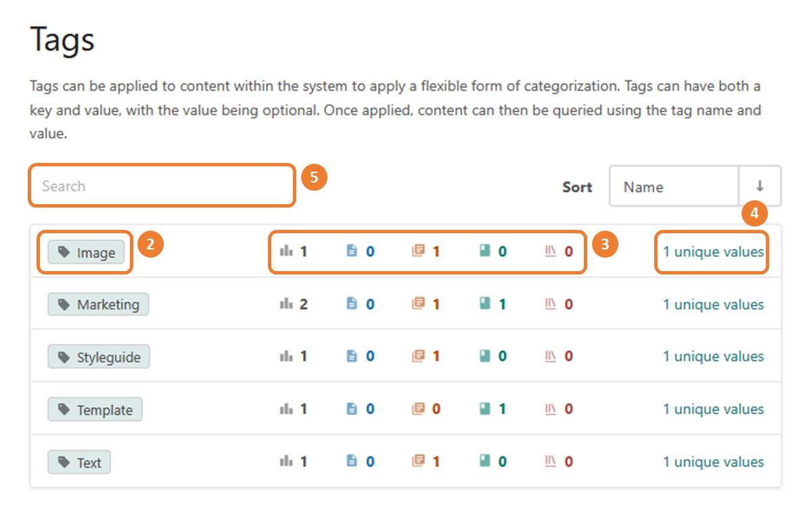{:.img-md} 
    *Tags*

    The Tags screen shows all the tags available to you and allows to browse through the objects, assigned to them:

2. To pass to advanced search by a tag, click on the relevant tag.

3. To view objects with the tag, click on the relevant option.

4. To manage the tag values, click on the tag unique values.

5. To search for a specific tag, start entering the tag name or value into the search line and press **Enter**.

## 3. Administrator Guide

The section provides directions on general actions available to the BookStack system administrators.

### 3.1. Open Settings

 
*Home* *To open Home, see [Login](#22-login)*

On the Home screen, click **Settings**. The Settings screen will open.

### 3.2. Objects

#### 3.2.1. Manage Object Permissions

 
*Shelf* *To open the object, see: [Open Shelf](#233-open-shelf), [Open Book](#243-open-book), [Open Page](#252-open-page), [Open Chapter](#262-open-chapter)*

1. On the object screen, click **Permissions**. The object permissions screen will open.

      
    *Shelf Permissions*

    On the object permissions screen:

2. To change the owner of the object, in the **Owner** dropdown, select the relevant user.

3. ??? "To override default role permissions:"

        1. For a specific role, in the **Override permissions for role** menu, select the relevant option. In the opened role section, check the relevant permission.

        2. For all users, in the **Everyone Else** section, check the relevant permission.

4. To save the changes, click **Save Permissions**.

#### 3.2.2. Restore Deleted Object

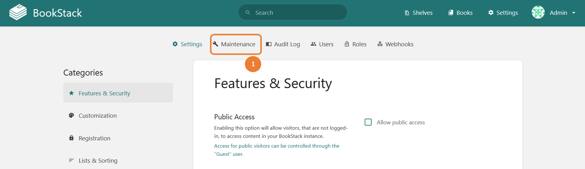 
*Settings* *To open Settings, see [Open Settings](#31-open-settings)*

1. On the Settings screen, click **Maintenance**. The Maintenance tab will open.

     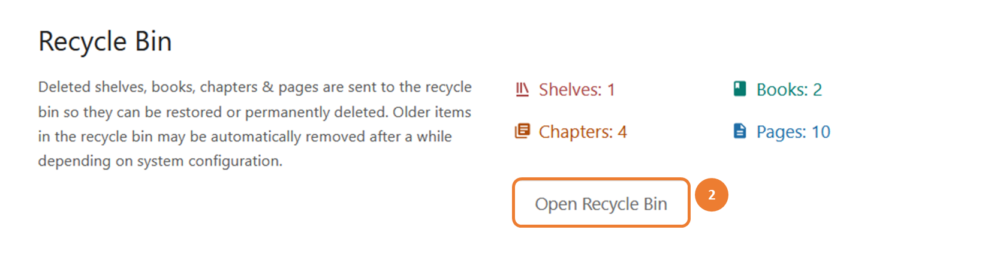 
    *Maintenance - Recycle Bin*

2. In the Maintenance tab, click **Open Recycle Bin**.

     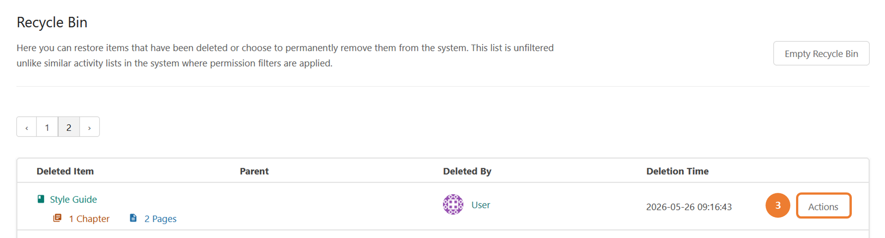 
    *Recycle Bin*

3. On the Recycle Bin screen, click **Actions**. In the opened dropdown, Click **Restore**. The Restore screen will open.

     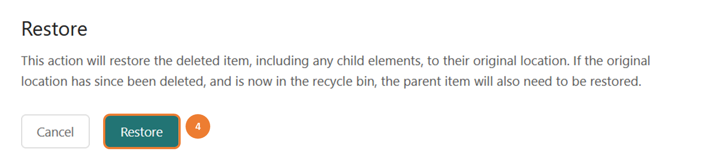{:.img-md} 
    *Restore*

4. On the Restore screen, click **Restore**. The object will be restored to its original location.

### 3.3. Users

#### 3.3.1. Browse Users

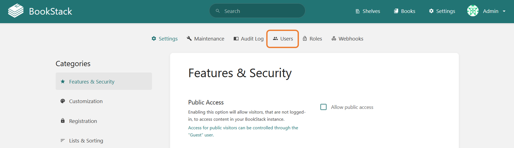 
*Settings* *To open Settings, see [Open Settings](#31-open-settings)*

On the Settings, click **Users**. The Users tab will open.

#### 3.3.2. Add User

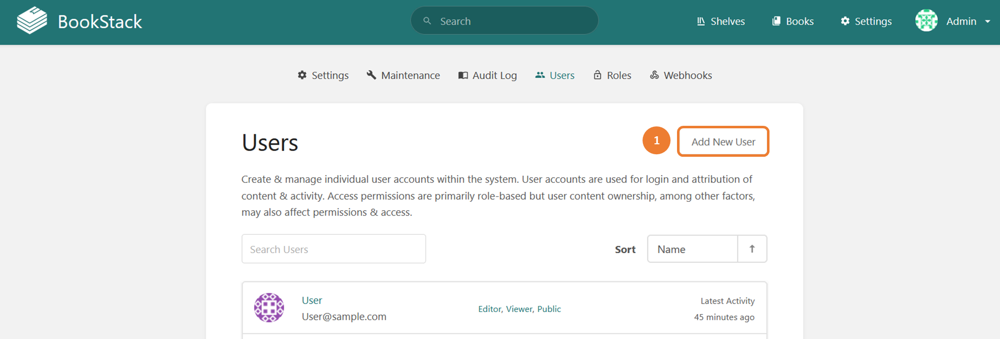 
*Users* *To open Users, see [Browse Users](#331-browse-users)*

1. On the Users tab, click **Add New User**. The Add New User screen will open.

      
    *Add New User - User Details*

    In the User Details Section:

2. Enter the new user name.

3. Enter the new user email.

     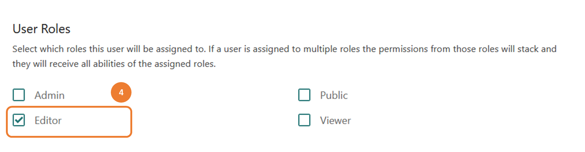 
    *Add New User - User Roles*

4. In the User Roles Section, select one or more roles for the new user.

     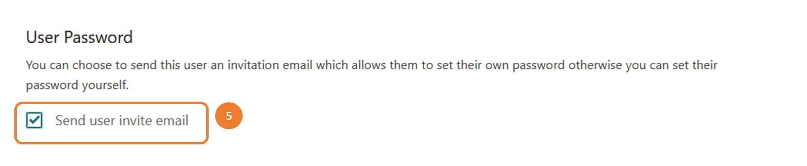 
    *Add New User - User Password*

5. In the User Password section, to optionally set the password for the new user yourself, uncheck **Send user invite email**. You will be prompted to enter and confirm the password.  Otherwise, the user will receive the invite email with directions to set the password and log in to the system.

     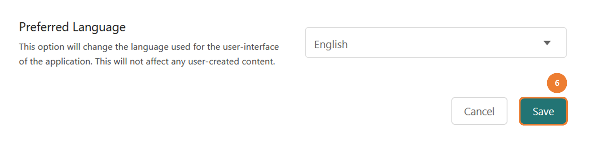 
    *Add New User - Save*

6. On the bottom of the Users Tab, click **Save**. The user will be added to the system.

#### 3.3.3. Edit User

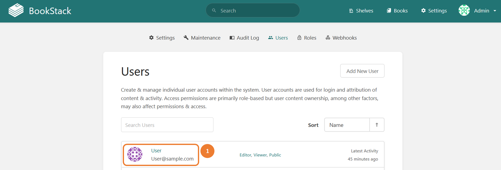 
*Users* *To open Users, see [Browse Users](#331-browse-users)*

1. On the Users tab, click on the relevant user. The Edit User screen will open.

     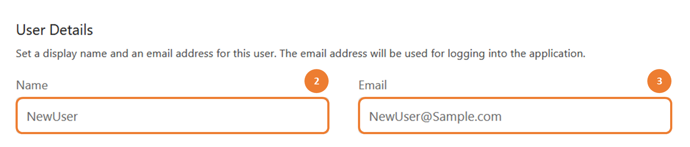 
    *Edit User - Users Details*

    In the User Details section:

2. Enter the new user name.
3. Enter the new user email.

      
    *Edit User - Users Roles*

4. In the User Roles section, select one or more roles for the new user.

     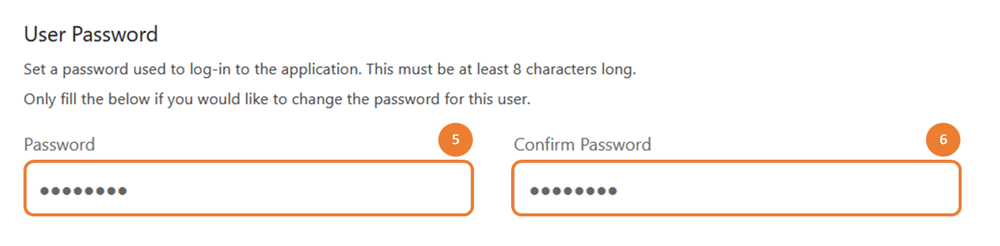 
    *Edit User - Users Password*

    In the User Password section:

5. To set a new password for the user, enter the password to the Password textbox.

6. To confirm the new password, enter the password to the Confirm Password textbox.

     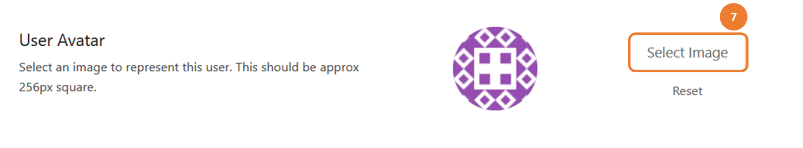 
    *Edit User - User Avatar*

7. In the User Avatar section, to set the user avatar, click **Select Image**. Browse to the relevant image.

     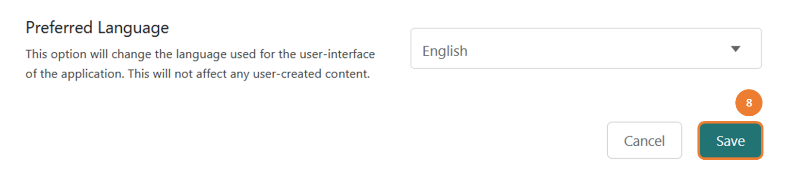 
    *Edit User - Save*

8. On the bottom of the User Tab, click **Save**. The user settings will be updated.

#### 3.3.4. Delete User

 
*Users* *To open Users, see [Browse Users](#331-browse-users)*

1. On the Users tab, click on the relevant user. The Edit User screen will open.

     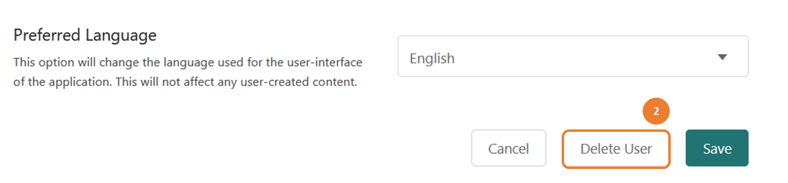 
    *Delete*

2. On the bottom of the Users Tab, click **Delete**. The Delete User screen will open.

     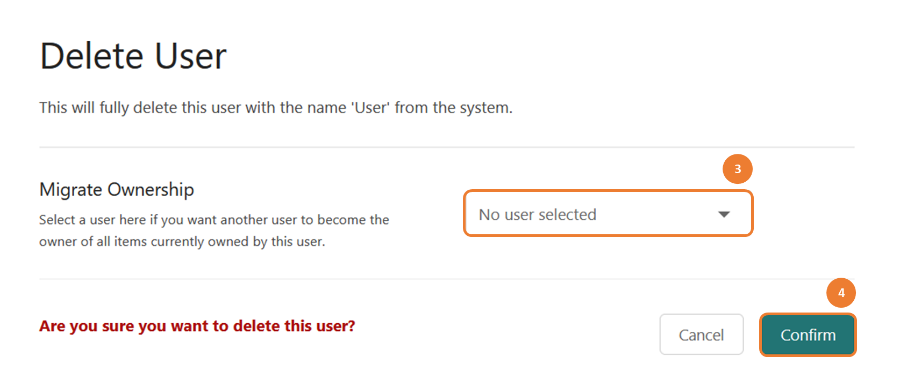{:.img-md} 
    *Delete User*

    On the Delete User screen:

3. To optionally pass the items currently owned by the user you are about to delete, in the Migrate Ownership section, select a new user.

4. Click **Confirm**. The user will be deleted.
