# BookStack   User Guide

November 2024

## 1. Document Info

The section traces the current document history from its initial composition to the latest version with indication of approval from the responsible parties. Included are the definitions of specific terms and references.

### 1.1. Versions

| Version | Author | Date (mm/dd/yyyy) | Description of Change |
| --- | --- | --- | --- |
| 1.0 | Andrey Orlov | 11.26.2024 | Initial version |

### 1.2. Approval

| Version | Approved by | Date (mm/dd/yyyy) |
| --- | --- | --- |
| 1.0 | Petr Petrov, System Architect | 11.26.2024 |

### 1.3. Terms

| Term | Definition |
| --- | --- |
| System | Information System |

### 1.4. References

| Item no. | Document title |
| --- | --- |
| 1 | [BookStack vendor documentation](https://www.bookstackapp.com/docs/) |

## 2. User Guide

The section provides directions on general actions available to the BookStack system users.

### 2.1. Introduction

BookStack is a documentation platform with features for organization of user content into a hierarchical structure of objects:

* [Shelves](#23-shelves): top-level containers used to group related books together.
* Books: main containers for content, serving as the highest level of organization for specific topics.
* Pages: objects of the lowest level that hold the actual text, images and diagrams.
* Chapters: optional containers within books used to group pages together.

Additionally, users can add tags to the content for flexible categorization. A tag has a key and an optional value. After a tag is applied, the content can then be queried using the tag name and value.

Among the other features are a complex search engine, a commenting system and a customizable document access model. Included is the default WYSIWYG text editor and an alternative Markdown editor.

### 2.2. Login

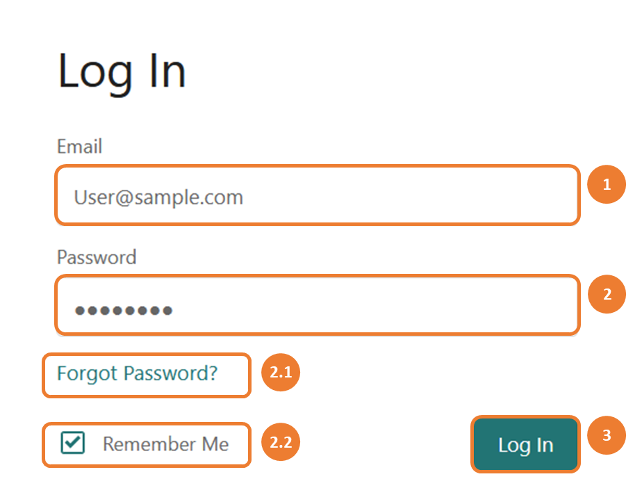{:.img-sm} 
*Login*

As you open BookStack, the login screen appears. To log in:

1. Enter your corporate email.

2. Enter the password.

    Optionally:
    
    1. ??? "In case you have forgotten the password, click **Forgot Password?** The Reset Password screen will open."

             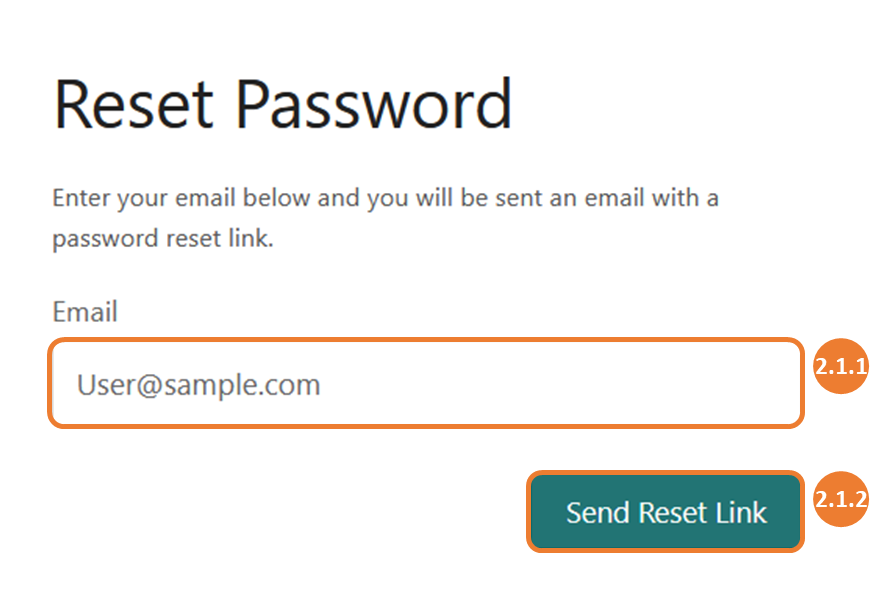{:.img-sm} 
            *Reset Password*

            On the Reset Password screen:

            1. Enter your corporate email.

            2. Click **Send Reset Link**. A link to reset your system password will be sent to your corporate email.

    2. To remember the user, check **Remember Me**.

3. Click **Log In**. The Home screen will open.

*If you are unable to log in or open the login screen, contact the Service Desk at [Service@sample.com](mailto:Service@sample.com)*

### 2.3. Shelves

#### 2.3.1. Browse Shelves

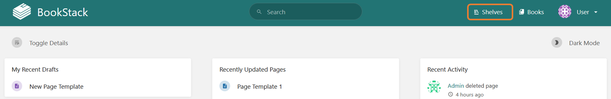 
*Home* *To open Home, see [Login](#22-login)*

On the Home screen, click **Shelves**. The Shelves screen will open.

#### 2.3.2. Create Shelf

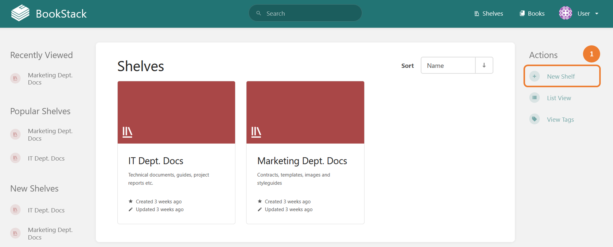 
*Shelves* *To open Shelves, see [Browse Shelves](#231-browse-shelves)*

1. On the Shelves screen, click **New Shelf**. The Create New Shelf screen will open.

     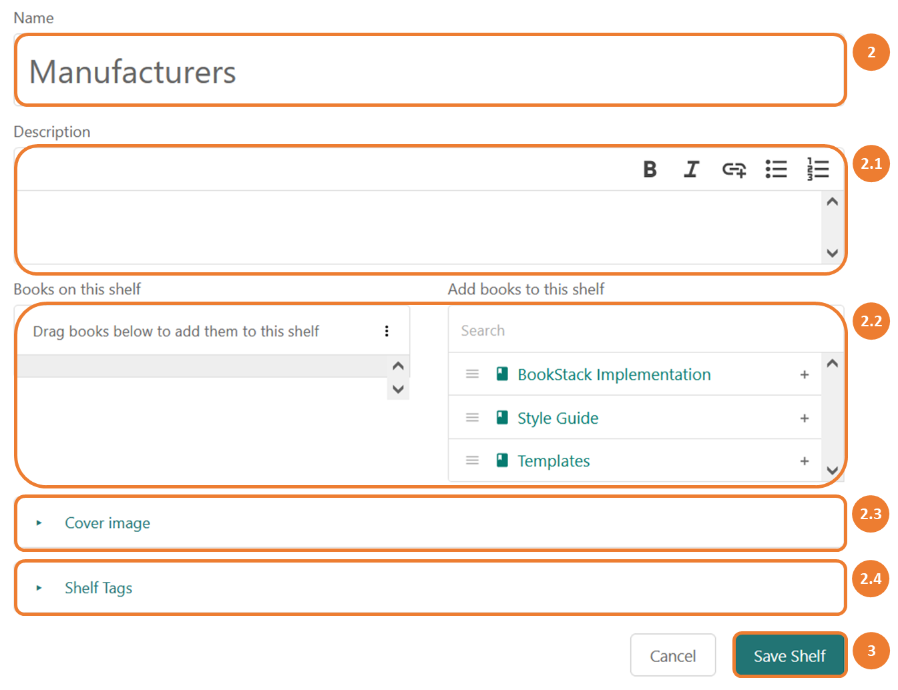{:.img-md} 
    *Create New Shelf*

    On the Create New Shelf screen:

2. Enter the name for the shelf.

    Optionally:
    
    1. Enter the description for the shelf.

    2. To add books to the shelf, drag and drop the books to the field on the left.

    3. ??? "To select a cover image, click **Cover image**."

             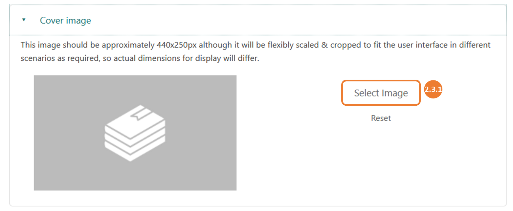{:.img-md} 
            *Cover Image*

            1. Click **Select Image** and browse to the image.

    4. ??? "To add tags to the shelf, click **Shelf Tags**."

             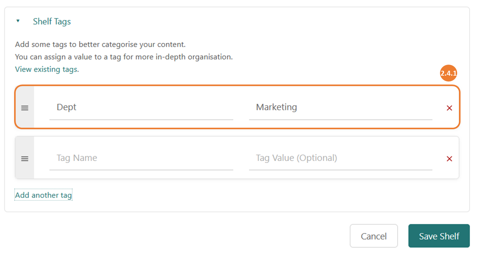{:.img-md} 
            *Shelf Tags*

            1. Enter the new tag name. Optionally, enter the value.

3. To save the changes, click **Save Shelf**.

#### 2.3.3. Open Shelf

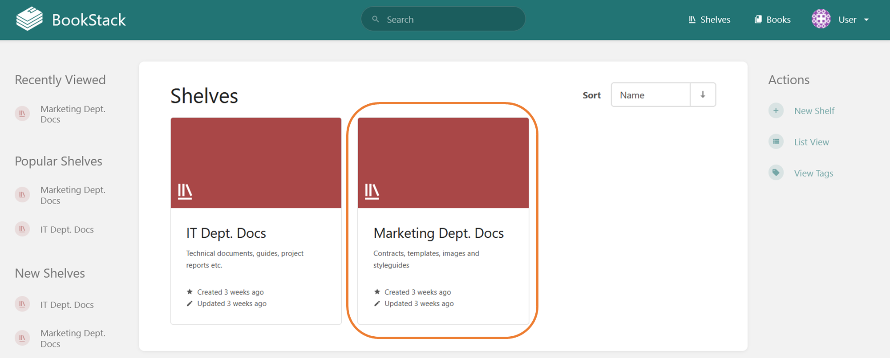 
*Shelves* *To open Shelves, see [Browse Shelves](#231-browse-shelves)*

On the Shelves screen, click on the relevant shelf. The Shelf screen will open.

## 3. Administrator Guide

The section provides directions on general actions available to the BookStack system administrators.

### 3.1. Open Settings

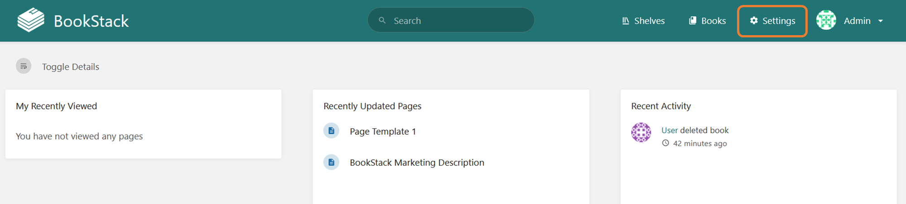 
*Home* *To open Home, see [Login](#22-login)*

On the Home screen, click **Settings**. The Settings screen will open.

### 3.2. Objects

#### 3.2.1. Manage Object Permissions

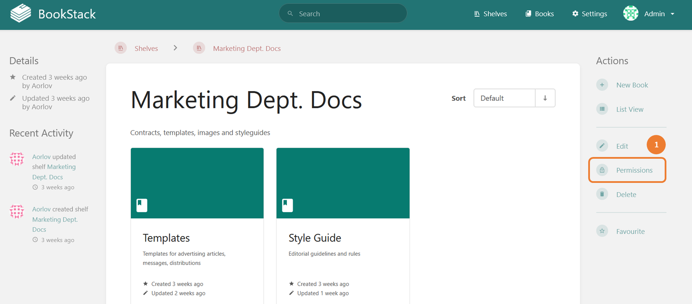 
*Shelf* *To open the object, see: [Open Shelf](#233-open-shelf)*

1. On the object screen, click **Permissions**. The object permissions screen will open.

     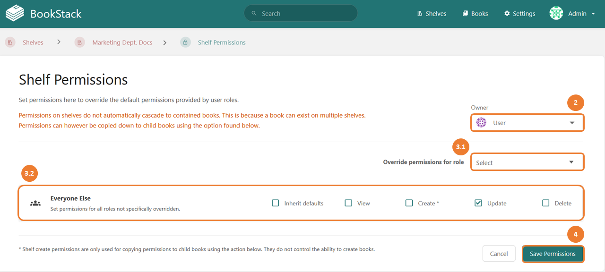 
    *Shelf Permissions*

    On the object permissions screen:

2. To change the owner of the object, in the **Owner** dropdown, select the relevant user.

3. ??? "To override default role permissions:"

        1. For a specific role, in the **Override permissions for role** menu, select the relevant option. In the opened role section, check the relevant permission.

        2. For all users, in the **Everyone Else** section, check the relevant permission.

4. To save the changes, click **Save Permissions**.

#### End of Demonstration Fragment

To view the full document, please contact Andrew D Orlov. See [Contacts](cv.md#contacts)